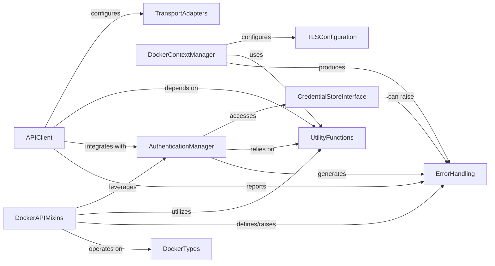

## Component Details

This graph illustrates the core components involved in Docker client operations, focusing on authentication, configuration, and daemon communication. The `APIClient` serves as the primary interface, establishing connections via `TransportAdapters` and managing authentication through the `AuthenticationManager`, which interacts with `CredentialStoreInterface` for secure credential handling. Docker contexts, defining connection parameters, are managed by the `DockerContextManager`, which also handles `TLSConfiguration`. Various `DockerAPIMixins` extend the client's capabilities for specific Docker resources, utilizing `UtilityFunctions` for common tasks. The `ErrorHandling` component provides a centralized mechanism for reporting issues across the system.

### AuthenticationManager
Manages Docker authentication configurations, including loading from files, parsing credentials, resolving authentication details for specific registries, and encoding/decoding authentication headers. It interacts with credential stores to retrieve and store sensitive information.

**Related Classes/Methods**:

- <a href="https://github.com/docker/docker-py/blob/master/docker/auth.py#L75-L306" target="_blank" rel="noopener noreferrer">`docker.auth.AuthConfig` (75:306)</a>
- <a href="https://github.com/docker/docker-py/blob/master/docker/auth.py#L144-L189" target="_blank" rel="noopener noreferrer">`docker.auth.AuthConfig:load_config` (144:189)</a>
- <a href="https://github.com/docker/docker-py/blob/master/docker/auth.py#L37-L56" target="_blank" rel="noopener noreferrer">`docker.auth.get_config_header` (37:56)</a>
- <a href="https://github.com/docker/docker-py/blob/master/docker/auth.py#L348-L349" target="_blank" rel="noopener noreferrer">`docker.auth.load_config` (348:349)</a>
- <a href="https://github.com/docker/docker-py/blob/master/docker/auth.py#L309-L312" target="_blank" rel="noopener noreferrer">`docker.auth.resolve_authconfig` (309:312)</a>
- <a href="https://github.com/docker/docker-py/blob/master/docker/auth.py#L327-L329" target="_blank" rel="noopener noreferrer">`docker.auth.encode_header` (327:329)</a>
- <a href="https://github.com/docker/docker-py/blob/master/docker/auth.py#L84-L141" target="_blank" rel="noopener noreferrer">`docker.auth.AuthConfig:parse_auth` (84:141)</a>
- <a href="https://github.com/docker/docker-py/blob/master/docker/auth.py#L209-L242" target="_blank" rel="noopener noreferrer">`docker.auth.AuthConfig:resolve_authconfig` (209:242)</a>
- <a href="https://github.com/docker/docker-py/blob/master/docker/auth.py#L244-L270" target="_blank" rel="noopener noreferrer">`docker.auth.AuthConfig:_resolve_authconfig_credstore` (244:270)</a>
- <a href="https://github.com/docker/docker-py/blob/master/docker/auth.py#L272-L277" target="_blank" rel="noopener noreferrer">`docker.auth.AuthConfig:_get_store_instance` (272:277)</a>
- <a href="https://github.com/docker/docker-py/blob/master/docker/auth.py#L285-L303" target="_blank" rel="noopener noreferrer">`docker.auth.AuthConfig:get_all_credentials` (285:303)</a>
- <a href="https://github.com/docker/docker-py/blob/master/docker/auth.py#L305-L306" target="_blank" rel="noopener noreferrer">`docker.auth.AuthConfig:add_auth` (305:306)</a>
- <a href="https://github.com/docker/docker-py/blob/master/docker/auth.py#L30-L34" target="_blank" rel="noopener noreferrer">`docker.auth.resolve_index_name` (30:34)</a>
- <a href="https://github.com/docker/docker-py/blob/master/docker/auth.py#L315-L316" target="_blank" rel="noopener noreferrer">`docker.auth.convert_to_hostname` (315:316)</a>
- <a href="https://github.com/docker/docker-py/blob/master/docker/auth.py#L319-L324" target="_blank" rel="noopener noreferrer">`docker.auth.decode_auth` (319:324)</a>
- <a href="https://github.com/docker/docker-py/blob/master/docker/auth.py#L332-L345" target="_blank" rel="noopener noreferrer">`docker.auth.parse_auth` (332:345)</a>
- <a href="https://github.com/docker/docker-py/blob/master/docker/auth.py#L352-L378" target="_blank" rel="noopener noreferrer">`docker.auth._load_legacy_config` (352:378)</a>

### CredentialStoreInterface
Provides an abstraction layer for interacting with external Docker credential helper programs, allowing the retrieval, storage, and listing of authentication credentials.

**Related Classes/Methods**:

- <a href="https://github.com/docker/docker-py/blob/master/docker/credentials/store.py#L11-L93" target="_blank" rel="noopener noreferrer">`docker.credentials.store.Store` (11:93)</a>
- <a href="https://github.com/docker/docker-py/blob/master/docker/credentials/store.py#L26-L44" target="_blank" rel="noopener noreferrer">`docker.credentials.store.Store:get` (26:44)</a>
- <a href="https://github.com/docker/docker-py/blob/master/docker/credentials/store.py#L46-L55" target="_blank" rel="noopener noreferrer">`docker.credentials.store.Store:store` (46:55)</a>
- <a href="https://github.com/docker/docker-py/blob/master/docker/credentials/store.py#L57-L63" target="_blank" rel="noopener noreferrer">`docker.credentials.store.Store:erase` (57:63)</a>
- <a href="https://github.com/docker/docker-py/blob/master/docker/credentials/store.py#L65-L69" target="_blank" rel="noopener noreferrer">`docker.credentials.store.Store:list` (65:69)</a>

### DockerContextManager
Handles the lifecycle and management of Docker contexts, which define connection parameters and configurations for different Docker daemon endpoints. This includes creating, loading, saving, inspecting, and removing contexts, as well as managing associated TLS certificates.

**Related Classes/Methods**:

- <a href="https://github.com/docker/docker-py/blob/master/docker/context/context.py#L16-L249" target="_blank" rel="noopener noreferrer">`docker.context.context.Context` (16:249)</a>
- <a href="https://github.com/docker/docker-py/blob/master/docker/context/context.py#L19-L60" target="_blank" rel="noopener noreferrer">`docker.context.context.Context:__init__` (19:60)</a>
- <a href="https://github.com/docker/docker-py/blob/master/docker/context/context.py#L62-L73" target="_blank" rel="noopener noreferrer">`docker.context.context.Context:set_endpoint` (62:73)</a>
- <a href="https://github.com/docker/docker-py/blob/master/docker/context/context.py#L75-L76" target="_blank" rel="noopener noreferrer">`docker.context.context.Context:inspect` (75:76)</a>
- <a href="https://github.com/docker/docker-py/blob/master/docker/context/context.py#L79-L90" target="_blank" rel="noopener noreferrer">`docker.context.context.Context:load_context` (79:90)</a>
- <a href="https://github.com/docker/docker-py/blob/master/docker/context/context.py#L93-L118" target="_blank" rel="noopener noreferrer">`docker.context.context.Context:_load_meta` (93:118)</a>
- <a href="https://github.com/docker/docker-py/blob/master/docker/context/context.py#L120-L144" target="_blank" rel="noopener noreferrer">`docker.context.context.Context:_load_certs` (120:144)</a>
- <a href="https://github.com/docker/docker-py/blob/master/docker/context/context.py#L146-L171" target="_blank" rel="noopener noreferrer">`docker.context.context.Context:save` (146:171)</a>
- <a href="https://github.com/docker/docker-py/blob/master/docker/context/context.py#L182-L183" target="_blank" rel="noopener noreferrer">`docker.context.context.Context:__str__` (182:183)</a>
- <a href="https://github.com/docker/docker-py/blob/master/docker/context/context.py#L173-L177" target="_blank" rel="noopener noreferrer">`docker.context.context.Context:remove` (173:177)</a>
- <a href="https://github.com/docker/docker-py/blob/master/docker/context/api.py#L15-L206" target="_blank" rel="noopener noreferrer">`docker.context.api.ContextAPI` (15:206)</a>
- <a href="https://github.com/docker/docker-py/blob/master/docker/context/api.py#L23-L70" target="_blank" rel="noopener noreferrer">`docker.context.api.ContextAPI:create_context` (23:70)</a>
- <a href="https://github.com/docker/docker-py/blob/master/docker/context/api.py#L73-L98" target="_blank" rel="noopener noreferrer">`docker.context.api.ContextAPI:get_context` (73:98)</a>
- <a href="https://github.com/docker/docker-py/blob/master/docker/context/api.py#L101-L125" target="_blank" rel="noopener noreferrer">`docker.context.api.ContextAPI:contexts` (101:125)</a>
- <a href="https://github.com/docker/docker-py/blob/master/docker/context/api.py#L128-L133" target="_blank" rel="noopener noreferrer">`docker.context.api.ContextAPI:get_current_context` (128:133)</a>
- <a href="https://github.com/docker/docker-py/blob/master/docker/context/api.py#L136-L144" target="_blank" rel="noopener noreferrer">`docker.context.api.ContextAPI:set_current_context` (136:144)</a>
- <a href="https://github.com/docker/docker-py/blob/master/docker/context/api.py#L147-L177" target="_blank" rel="noopener noreferrer">`docker.context.api.ContextAPI:remove_context` (147:177)</a>
- <a href="https://github.com/docker/docker-py/blob/master/docker/context/api.py#L180-L206" target="_blank" rel="noopener noreferrer">`docker.context.api.ContextAPI:inspect_context` (180:206)</a>
- <a href="https://github.com/docker/docker-py/blob/master/docker/context/config.py#L75-L81" target="_blank" rel="noopener noreferrer">`docker.context.config.get_context_host` (75:81)</a>
- <a href="https://github.com/docker/docker-py/blob/master/docker/context/config.py#L57-L61" target="_blank" rel="noopener noreferrer">`docker.context.config.get_meta_dir` (57:61)</a>
- <a href="https://github.com/docker/docker-py/blob/master/docker/context/config.py#L64-L65" target="_blank" rel="noopener noreferrer">`docker.context.config.get_meta_file` (64:65)</a>
- <a href="https://github.com/docker/docker-py/blob/master/docker/context/config.py#L68-L72" target="_blank" rel="noopener noreferrer">`docker.context.config.get_tls_dir` (68:72)</a>
- <a href="https://github.com/docker/docker-py/blob/master/docker/context/config.py#L12-L21" target="_blank" rel="noopener noreferrer">`docker.context.config.get_current_context_name` (12:21)</a>
- <a href="https://github.com/docker/docker-py/blob/master/docker/context/config.py#L24-L46" target="_blank" rel="noopener noreferrer">`docker.context.config.write_context_name_to_docker_config` (24:46)</a>

### APIClient
The core client component responsible for establishing and managing connections to the Docker daemon. It handles initial configuration loading, proxy settings, transport layer selection (Unix socket, Npipe, SSH), and server version negotiation.

**Related Classes/Methods**:

- <a href="https://github.com/docker/docker-py/blob/master/docker/api/client.py#L57-L532" target="_blank" rel="noopener noreferrer">`docker.api.client.APIClient` (57:532)</a>
- <a href="https://github.com/docker/docker-py/blob/master/docker/api/client.py#L115-L219" target="_blank" rel="noopener noreferrer">`docker.api.client.APIClient:__init__` (115:219)</a>
- <a href="https://github.com/docker/docker-py/blob/master/docker/api/client.py#L518-L532" target="_blank" rel="noopener noreferrer">`docker.api.client.APIClient:reload_config` (518:532)</a>
- <a href="https://github.com/docker/docker-py/blob/master/docker/api/client.py#L501-L503" target="_blank" rel="noopener noreferrer">`docker.api.client.APIClient._unmount` (501:503)</a>
- <a href="https://github.com/docker/docker-py/blob/master/docker/api/client.py#L221-L232" target="_blank" rel="noopener noreferrer">`docker.api.client.APIClient._retrieve_server_version` (221:232)</a>

### DockerAPIMixins
A collection of mixin classes that extend the core API client with specific functionalities for interacting with different Docker resources, such as daemon, build, plugin, service, and image operations. These mixins often integrate with authentication and utility functions.

**Related Classes/Methods**:

- <a href="https://github.com/docker/docker-py/blob/master/docker/api/daemon.py#L97-L152" target="_blank" rel="noopener noreferrer">`docker.api.daemon.DaemonApiMixin:login` (97:152)</a>
- <a href="https://github.com/docker/docker-py/blob/master/docker/api/build.py#L321-L352" target="_blank" rel="noopener noreferrer">`docker.api.build.BuildApiMixin:_set_auth_headers` (321:352)</a>
- <a href="https://github.com/docker/docker-py/blob/master/docker/api/plugin.py#L106-L141" target="_blank" rel="noopener noreferrer">`docker.api.plugin.PluginApiMixin:pull_plugin` (106:141)</a>
- <a href="https://github.com/docker/docker-py/blob/master/docker/api/plugin.py#L155-L181" target="_blank" rel="noopener noreferrer">`docker.api.plugin.PluginApiMixin:plugin_privileges` (155:181)</a>
- <a href="https://github.com/docker/docker-py/blob/master/docker/api/plugin.py#L185-L205" target="_blank" rel="noopener noreferrer">`docker.api.plugin.PluginApiMixin:push_plugin` (185:205)</a>
- <a href="https://github.com/docker/docker-py/blob/master/docker/api/plugin.py#L229-L261" target="_blank" rel="noopener noreferrer">`docker.api.plugin.PluginApiMixin:upgrade_plugin` (229:261)</a>
- <a href="https://github.com/docker/docker-py/blob/master/docker/api/service.py#L116-L189" target="_blank" rel="noopener noreferrer">`docker.api.service.ServiceApiMixin:create_service` (116:189)</a>
- <a href="https://github.com/docker/docker-py/blob/master/docker/api/service.py#L369-L486" target="_blank" rel="noopener noreferrer">`docker.api.service.ServiceApiMixin:update_service` (369:486)</a>
- <a href="https://github.com/docker/docker-py/blob/master/docker/api/service.py#L193-L219" target="_blank" rel="noopener noreferrer">`docker.api.service.ServiceApiMixin.inspect_service` (193:219)</a>
- <a href="https://github.com/docker/docker-py/blob/master/docker/api/service.py#L5-L96" target="_blank" rel="noopener noreferrer">`docker.api.service._check_api_features` (5:96)</a>
- <a href="https://github.com/docker/docker-py/blob/master/docker/api/service.py#L99-L111" target="_blank" rel="noopener noreferrer">`docker.api.service._merge_task_template` (99:111)</a>
- <a href="https://github.com/docker/docker-py/blob/master/docker/api/image.py#L257-L289" target="_blank" rel="noopener noreferrer">`docker.api.image.ImageApiMixin:inspect_distribution` (257:289)</a>
- <a href="https://github.com/docker/docker-py/blob/master/docker/api/image.py#L351-L434" target="_blank" rel="noopener noreferrer">`docker.api.image.ImageApiMixin:pull` (351:434)</a>
- <a href="https://github.com/docker/docker-py/blob/master/docker/api/image.py#L436-L500" target="_blank" rel="noopener noreferrer">`docker.api.image.ImageApiMixin:push` (436:500)</a>

### UtilityFunctions
Provides a set of general-purpose helper functions used across the docker-py library for tasks such as configuration file discovery, proxy settings parsing, version comparison, and decorator application for API methods.

**Related Classes/Methods**:

- <a href="https://github.com/docker/docker-py/blob/master/docker/utils/config.py#L13-L30" target="_blank" rel="noopener noreferrer">`docker.utils.config.find_config_file` (13:30)</a>
- <a href="https://github.com/docker/docker-py/blob/master/docker/utils/config.py#L51-L66" target="_blank" rel="noopener noreferrer">`docker.utils.config.load_general_config` (51:66)</a>
- <a href="https://github.com/docker/docker-py/blob/master/docker/utils/proxy.py#L25-L38" target="_blank" rel="noopener noreferrer">`docker.utils.proxy.ProxyConfig.from_dict` (25:38)</a>
- <a href="https://github.com/docker/docker-py/blob/master/docker/utils/utils.py#L233-L321" target="_blank" rel="noopener noreferrer">`docker.utils.utils.parse_host` (233:321)</a>
- <a href="https://github.com/docker/docker-py/blob/master/docker/utils/utils.py#L77-L78" target="_blank" rel="noopener noreferrer">`docker.utils.utils.version_lt` (77:78)</a>
- <a href="https://github.com/docker/docker-py/blob/master/docker/utils/utils.py#L209-L220" target="_blank" rel="noopener noreferrer">`docker.utils.utils.convert_service_networks` (209:220)</a>
- `docker.utils.utils` (full file reference)
- <a href="https://github.com/docker/docker-py/blob/master/docker/utils/decorators.py#L24-L34" target="_blank" rel="noopener noreferrer">`docker.utils.decorators.minimum_version` (24:34)</a>
- <a href="https://github.com/docker/docker-py/blob/master/docker/utils/decorators.py#L7-L21" target="_blank" rel="noopener noreferrer">`docker.utils.decorators.check_resource` (7:21)</a>

### ErrorHandling
Centralized component for defining and raising specific exceptions related to Docker operations, configuration issues, authentication failures, and context management.

**Related Classes/Methods**:

- <a href="https://github.com/docker/docker-py/blob/master/docker/errors.py#L108-L109" target="_blank" rel="noopener noreferrer">`docker.errors.InvalidConfigFile` (108:109)</a>
- <a href="https://github.com/docker/docker-py/blob/master/docker/errors.py#L13-L19" target="_blank" rel="noopener noreferrer">`docker.errors.DockerException` (13:19)</a>
- <a href="https://github.com/docker/docker-py/blob/master/docker/credentials/errors.py#L5-L6" target="_blank" rel="noopener noreferrer">`docker.credentials.errors.CredentialsNotFound` (5:6)</a>
- <a href="https://github.com/docker/docker-py/blob/master/docker/errors.py#L196-L201" target="_blank" rel="noopener noreferrer">`docker.errors.ContextException` (196:201)</a>
- <a href="https://github.com/docker/docker-py/blob/master/docker/errors.py#L180-L185" target="_blank" rel="noopener noreferrer">`docker.errors.MissingContextParameter` (180:185)</a>
- <a href="https://github.com/docker/docker-py/blob/master/docker/errors.py#L188-L193" target="_blank" rel="noopener noreferrer">`docker.errors.ContextAlreadyExists` (188:193)</a>
- <a href="https://github.com/docker/docker-py/blob/master/docker/errors.py#L204-L209" target="_blank" rel="noopener noreferrer">`docker.errors.ContextNotFound` (204:209)</a>
- <a href="https://github.com/docker/docker-py/blob/master/docker/errors.py#L120-L128" target="_blank" rel="noopener noreferrer">`docker.errors.TLSParameterError` (120:128)</a>
- <a href="https://github.com/docker/docker-py/blob/master/docker/errors.py#L100-L101" target="_blank" rel="noopener noreferrer">`docker.errors.InvalidVersion` (100:101)</a>

### TransportAdapters
Manages the underlying HTTP transport mechanisms for communicating with the Docker daemon, supporting various connection types like Unix sockets, named pipes (Npipe), and SSH.

**Related Classes/Methods**:

- <a href="https://github.com/docker/docker-py/blob/master/docker/transport/unixconn.py#L45-L86" target="_blank" rel="noopener noreferrer">`docker.transport.unixconn.UnixHTTPAdapter` (45:86)</a>
- <a href="https://github.com/docker/docker-py/blob/master/docker/transport/npipeconn.py#L64-L102" target="_blank" rel="noopener noreferrer">`docker.transport.npipeconn.NpipeHTTPAdapter` (64:102)</a>
- <a href="https://github.com/docker/docker-py/blob/master/docker/transport/sshconn.py#L159-L250" target="_blank" rel="noopener noreferrer">`docker.transport.sshconn.SSHHTTPAdapter` (159:250)</a>

### TLSConfiguration
Handles the configuration and management of Transport Layer Security (TLS) settings for secure communication with the Docker daemon.

**Related Classes/Methods**:

- <a href="https://github.com/docker/docker-py/blob/master/docker/tls.py#L6-L67" target="_blank" rel="noopener noreferrer">`docker.tls.TLSConfig` (6:67)</a>

### DockerTypes
Defines data structures and models for various Docker objects, such as service modes, used in API interactions.

**Related Classes/Methods**:

- <a href="https://github.com/docker/docker-py/blob/master/docker/types/services.py#L595-L660" target="_blank" rel="noopener noreferrer">`docker.types.services.ServiceMode` (595:660)</a>

### [FAQ](https://github.com/CodeBoarding/GeneratedOnBoardings/tree/main?tab=readme-ov-file#faq)