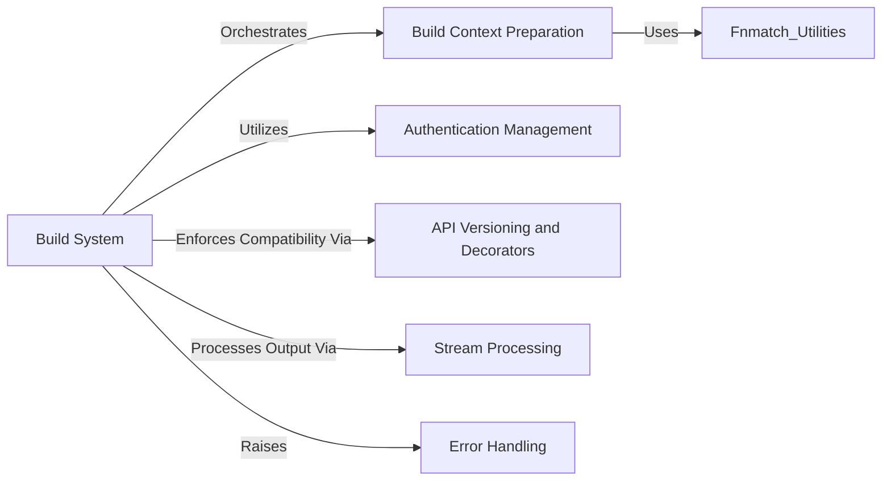

## Component Details

This graph illustrates the core components and their interactions within the `docker-py` library's build system. The primary flow revolves around the `Build System` component, which orchestrates the entire image building process. It relies on `Build Context Preparation` to create the necessary build context, `Authentication Management` for handling registry credentials, and `Stream Processing` to interpret the real-time output from the Docker daemon. `API Versioning and Decorators` ensure compatibility with different Docker API versions, while `Error Handling` provides structured error reporting for various build-related issues.

### Build System
Manages the end-to-end process of building Docker images, including orchestrating context preparation, applying authentication, and processing build output streams. It serves as the primary interface for image creation within the `docker-py` library.

**Related Classes/Methods**:

- <a href="https://github.com/docker/docker-py/blob/master/docker/api/build.py#L11-L352" target="_blank" rel="noopener noreferrer">`docker-py.docker.api.build.BuildApiMixin` (11:352)</a>
- <a href="https://github.com/docker/docker-py/blob/master/docker/api/build.py#L12-L275" target="_blank" rel="noopener noreferrer">`docker-py.docker.api.build.BuildApiMixin:build` (12:275)</a>
- <a href="https://github.com/docker/docker-py/blob/master/docker/api/build.py#L321-L352" target="_blank" rel="noopener noreferrer">`docker-py.docker.api.build.BuildApiMixin:_set_auth_headers` (321:352)</a>
- <a href="https://github.com/docker/docker-py/blob/master/docker/api/build.py#L355-L382" target="_blank" rel="noopener noreferrer">`docker-py.docker.api.build.process_dockerfile` (355:382)</a>
- <a href="https://github.com/docker/docker-py/blob/master/docker/models/images.py#L220-L315" target="_blank" rel="noopener noreferrer">`docker-py.docker.models.images.ImageCollection:build` (220:315)</a>

### Build Context Preparation
Responsible for preparing the local build context for Docker image creation. This includes archiving the necessary files and directories, applying exclusion rules from `.dockerignore`, and ensuring the context is ready for transmission to the Docker daemon.

**Related Classes/Methods**:

- <a href="https://github.com/docker/docker-py/blob/master/docker/utils/build.py#L70-L120" target="_blank" rel="noopener noreferrer">`docker-py.docker.utils.build:create_archive` (70:120)</a>
- <a href="https://github.com/docker/docker-py/blob/master/docker/utils/build.py#L41-L55" target="_blank" rel="noopener noreferrer">`docker-py.docker.utils.build:exclude_paths` (41:55)</a>
- <a href="https://github.com/docker/docker-py/blob/master/docker/utils/build.py#L22-L38" target="_blank" rel="noopener noreferrer">`docker-py.docker.utils.build:tar` (22:38)</a>
- <a href="https://github.com/docker/docker-py/blob/master/docker/utils/build.py#L159-L219" target="_blank" rel="noopener noreferrer">`docker-py.docker.utils.build.PatternMatcher` (159:219)</a>
- <a href="https://github.com/docker/docker-py/blob/master/docker/utils/build.py#L166-L183" target="_blank" rel="noopener noreferrer">`docker-py.docker.utils.build.PatternMatcher:matches` (166:183)</a>
- <a href="https://github.com/docker/docker-py/blob/master/docker/utils/build.py#L58-L67" target="_blank" rel="noopener noreferrer">`docker-py.docker.utils.build.build_file_list` (58:67)</a>
- <a href="https://github.com/docker/docker-py/blob/master/docker/utils/build.py#L123-L139" target="_blank" rel="noopener noreferrer">`docker-py.docker.utils.build.mkbuildcontext` (123:139)</a>
- <a href="https://github.com/docker/docker-py/blob/master/docker/utils/fnmatch.py#L26-L44" target="_blank" rel="noopener noreferrer">`docker-py.docker.utils.fnmatch:fnmatch` (26:44)</a>
- <a href="https://github.com/docker/docker-py/blob/master/docker/utils/fnmatch.py#L47-L60" target="_blank" rel="noopener noreferrer">`docker-py.docker.utils.fnmatch:fnmatchcase` (47:60)</a>
- <a href="https://github.com/docker/docker-py/blob/master/docker/utils/fnmatch.py#L63-L115" target="_blank" rel="noopener noreferrer">`docker-py.docker.utils.fnmatch:translate` (63:115)</a>

### Authentication Management
Handles the loading, parsing, and resolution of Docker authentication configurations. It provides mechanisms to retrieve credentials from various sources and format them for inclusion in API requests, particularly for pulling base images during a build.

**Related Classes/Methods**:

- <a href="https://github.com/docker/docker-py/blob/master/docker/auth.py#L348-L349" target="_blank" rel="noopener noreferrer">`docker-py.docker.auth:load_config` (348:349)</a>
- <a href="https://github.com/docker/docker-py/blob/master/docker/auth.py#L75-L306" target="_blank" rel="noopener noreferrer">`docker-py.docker.auth.AuthConfig` (75:306)</a>
- <a href="https://github.com/docker/docker-py/blob/master/docker/auth.py#L144-L189" target="_blank" rel="noopener noreferrer">`docker-py.docker.auth.AuthConfig.load_config` (144:189)</a>
- <a href="https://github.com/docker/docker-py/blob/master/docker/auth.py#L285-L303" target="_blank" rel="noopener noreferrer">`docker-py.docker.auth.AuthConfig.get_all_credentials` (285:303)</a>
- <a href="https://github.com/docker/docker-py/blob/master/docker/auth.py#L272-L277" target="_blank" rel="noopener noreferrer">`docker-py.docker.auth.AuthConfig._get_store_instance` (272:277)</a>
- <a href="https://github.com/docker/docker-py/blob/master/docker/auth.py#L244-L270" target="_blank" rel="noopener noreferrer">`docker-py.docker.auth.AuthConfig._resolve_authconfig_credstore` (244:270)</a>
- <a href="https://github.com/docker/docker-py/blob/master/docker/auth.py#L315-L316" target="_blank" rel="noopener noreferrer">`docker-py.docker.auth.convert_to_hostname` (315:316)</a>
- <a href="https://github.com/docker/docker-py/blob/master/docker/auth.py#L327-L329" target="_blank" rel="noopener noreferrer">`docker-py.docker.auth.encode_header` (327:329)</a>
- <a href="https://github.com/docker/docker-py/blob/master/docker/auth.py#L309-L312" target="_blank" rel="noopener noreferrer">`docker-py.docker.auth.resolve_authconfig` (309:312)</a>
- <a href="https://github.com/docker/docker-py/blob/master/docker/auth.py#L319-L324" target="_blank" rel="noopener noreferrer">`docker-py.docker.auth.decode_auth` (319:324)</a>
- <a href="https://github.com/docker/docker-py/blob/master/docker/auth.py#L332-L345" target="_blank" rel="noopener noreferrer">`docker-py.docker.auth.parse_auth` (332:345)</a>
- <a href="https://github.com/docker/docker-py/blob/master/docker/auth.py#L352-L378" target="_blank" rel="noopener noreferrer">`docker-py.docker.auth._load_legacy_config` (352:378)</a>

### API Versioning and Decorators
Provides utilities for comparing Docker API versions and implements decorators to enforce minimum API versions for client methods. This ensures that API calls are compatible with the connected Docker daemon and handles version-specific behaviors.

**Related Classes/Methods**:

- <a href="https://github.com/docker/docker-py/blob/master/docker/utils/utils.py#L77-L78" target="_blank" rel="noopener noreferrer">`docker-py.docker.utils.utils:version_lt` (77:78)</a>
- <a href="https://github.com/docker/docker-py/blob/master/docker/utils/utils.py#L81-L82" target="_blank" rel="noopener noreferrer">`docker-py.docker.utils.utils:version_gte` (81:82)</a>
- <a href="https://github.com/docker/docker-py/blob/master/docker/utils/utils.py#L49-L74" target="_blank" rel="noopener noreferrer">`docker-py.docker.utils.utils:compare_version` (49:74)</a>
- <a href="https://github.com/docker/docker-py/blob/master/docker/utils/decorators.py#L24-L34" target="_blank" rel="noopener noreferrer">`docker-py.docker.utils.decorators:minimum_version` (24:34)</a>

### Stream Processing
Manages the parsing and handling of streaming data, particularly JSON streams, received from the Docker daemon. This component is crucial for processing real-time output during long-running operations like image builds, enabling progress reporting and error detection.

**Related Classes/Methods**:

- <a href="https://github.com/docker/docker-py/blob/master/docker/utils/json_stream.py#L35-L40" target="_blank" rel="noopener noreferrer">`docker-py.docker.utils.json_stream:json_stream` (35:40)</a>
- <a href="https://github.com/docker/docker-py/blob/master/docker/utils/json_stream.py#L50-L74" target="_blank" rel="noopener noreferrer">`docker-py.docker.utils.json_stream:split_buffer` (50:74)</a>
- <a href="https://github.com/docker/docker-py/blob/master/docker/utils/json_stream.py#L9-L19" target="_blank" rel="noopener noreferrer">`docker-py.docker.utils.json_stream.stream_as_text` (9:19)</a>
- <a href="https://github.com/docker/docker-py/blob/master/docker/utils/json_stream.py#L43-L47" target="_blank" rel="noopener noreferrer">`docker-py.docker.utils.json_stream.line_splitter` (43:47)</a>

### Error Handling
Defines a hierarchy of custom exception classes used throughout the `docker-py` library. These exceptions represent specific error conditions encountered during interactions with the Docker daemon or due to invalid client-side operations, providing structured error reporting.

**Related Classes/Methods**:

- <a href="https://github.com/docker/docker-py/blob/master/docker/errors.py#L100-L101" target="_blank" rel="noopener noreferrer">`docker-py.docker.errors.InvalidVersion` (100:101)</a>
- <a href="https://github.com/docker/docker-py/blob/master/docker/errors.py#L13-L19" target="_blank" rel="noopener noreferrer">`docker-py.docker.errors.DockerException` (13:19)</a>
- <a href="https://github.com/docker/docker-py/blob/master/docker/errors.py#L153-L155" target="_blank" rel="noopener noreferrer">`docker-py.docker.errors.StreamParseError` (153:155)</a>
- <a href="https://github.com/docker/docker-py/blob/master/docker/errors.py#L158-L162" target="_blank" rel="noopener noreferrer">`docker-py.docker.errors.BuildError` (158:162)</a>

### [FAQ](https://github.com/CodeBoarding/GeneratedOnBoardings/tree/main?tab=readme-ov-file#faq)