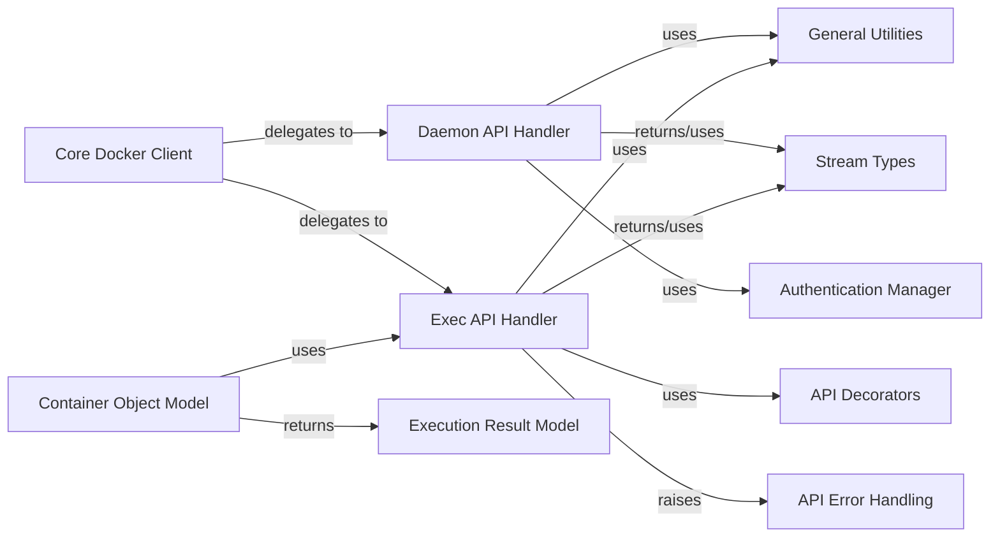

## Component Details

This component overview describes the structure and interactions of the Docker daemon and execution operations subsystem. It details how the core client interacts with dedicated API handlers for daemon-level information and container command execution, leveraging various utility and model components for authentication, data streaming, error handling, and object representation.

### Daemon API Handler
Manages interactions with the Docker daemon for system-level information, real-time events, and user authentication.

**Related Classes/Methods**:

- <a href="https://github.com/docker/docker-py/blob/master/docker/api/daemon.py#L7-L181" target="_blank" rel="noopener noreferrer">`docker.api.daemon.DaemonApiMixin` (7:181)</a>
- <a href="https://github.com/docker/docker-py/blob/master/docker/api/daemon.py#L83-L95" target="_blank" rel="noopener noreferrer">`docker.api.daemon.DaemonApiMixin:info` (83:95)</a>
- <a href="https://github.com/docker/docker-py/blob/master/docker/api/daemon.py#L24-L81" target="_blank" rel="noopener noreferrer">`docker.api.daemon.DaemonApiMixin:events` (24:81)</a>
- <a href="https://github.com/docker/docker-py/blob/master/docker/api/daemon.py#L97-L152" target="_blank" rel="noopener noreferrer">`docker.api.daemon.DaemonApiMixin:login` (97:152)</a>

### Exec API Handler
Provides functionalities for creating and starting execution commands within Docker containers.

**Related Classes/Methods**:

- <a href="https://github.com/docker/docker-py/blob/master/docker/api/exec_api.py#L5-L176" target="_blank" rel="noopener noreferrer">`docker.api.exec_api.ExecApiMixin` (5:176)</a>
- <a href="https://github.com/docker/docker-py/blob/master/docker/api/exec_api.py#L7-L78" target="_blank" rel="noopener noreferrer">`docker.api.exec_api.ExecApiMixin:exec_create` (7:78)</a>
- <a href="https://github.com/docker/docker-py/blob/master/docker/api/exec_api.py#L118-L176" target="_blank" rel="noopener noreferrer">`docker.api.exec_api.ExecApiMixin:exec_start` (118:176)</a>

### Core Docker Client
The primary entry point for users to interact with the Docker API, abstracting underlying API calls and delegating to specific API handlers.

**Related Classes/Methods**:

- <a href="https://github.com/docker/docker-py/blob/master/docker/client.py#L16-L219" target="_blank" rel="noopener noreferrer">`docker.client.DockerClient` (16:219)</a>
- <a href="https://github.com/docker/docker-py/blob/master/docker/client.py#L184-L185" target="_blank" rel="noopener noreferrer">`docker.client.DockerClient:events` (184:185)</a>
- <a href="https://github.com/docker/docker-py/blob/master/docker/client.py#L192-L193" target="_blank" rel="noopener noreferrer">`docker.client.DockerClient:info` (192:193)</a>
- <a href="https://github.com/docker/docker-py/blob/master/docker/client.py#L196-L197" target="_blank" rel="noopener noreferrer">`docker.client.DockerClient:login` (196:197)</a>

### General Utilities
A collection of helper functions for data manipulation, filtering, command parsing, environment formatting, and version comparisons.

**Related Classes/Methods**:

- <a href="https://github.com/docker/docker-py/blob/master/docker/utils/utils.py#L1-L206" target="_blank" rel="noopener noreferrer">`docker.utils.utils` (1:206)</a>
- <a href="https://github.com/docker/docker-py/blob/master/docker/utils/utils.py#L405-L408" target="_blank" rel="noopener noreferrer">`docker.utils.utils.datetime_to_timestamp` (405:408)</a>
- <a href="https://github.com/docker/docker-py/blob/master/docker/utils/utils.py#L391-L402" target="_blank" rel="noopener noreferrer">`docker.utils.utils.convert_filters` (391:402)</a>
- <a href="https://github.com/docker/docker-py/blob/master/docker/utils/utils.py#L77-L78" target="_blank" rel="noopener noreferrer">`docker.utils.utils.version_lt` (77:78)</a>
- <a href="https://github.com/docker/docker-py/blob/master/docker/utils/utils.py#L486-L487" target="_blank" rel="noopener noreferrer">`docker.utils.utils.split_command` (486:487)</a>
- <a href="https://github.com/docker/docker-py/blob/master/docker/utils/utils.py#L490-L498" target="_blank" rel="noopener noreferrer">`docker.utils.utils.format_environment` (490:498)</a>

### Authentication Manager
Handles the loading, resolution, and management of Docker registry authentication configurations.

**Related Classes/Methods**:

- <a href="https://github.com/docker/docker-py/blob/master/docker/auth.py#L348-L349" target="_blank" rel="noopener noreferrer">`docker.auth.load_config` (348:349)</a>
- <a href="https://github.com/docker/docker-py/blob/master/docker/auth.py#L75-L306" target="_blank" rel="noopener noreferrer">`docker.auth.AuthConfig` (75:306)</a>
- <a href="https://github.com/docker/docker-py/blob/master/docker/auth.py#L209-L242" target="_blank" rel="noopener noreferrer">`docker.auth.AuthConfig.resolve_authconfig` (209:242)</a>
- <a href="https://github.com/docker/docker-py/blob/master/docker/auth.py#L305-L306" target="_blank" rel="noopener noreferrer">`docker.auth.AuthConfig.add_auth` (305:306)</a>

### Stream Types
Defines specialized data structures for managing cancellable data streams, typically used for real-time event monitoring.

**Related Classes/Methods**:

- <a href="https://github.com/docker/docker-py/blob/master/docker/types/daemon.py#L8-L71" target="_blank" rel="noopener noreferrer">`docker.types.daemon.CancellableStream` (8:71)</a>

### API Error Handling
Provides specific error classes for handling exceptions related to Docker API version compatibility.

**Related Classes/Methods**:

- <a href="https://github.com/docker/docker-py/blob/master/docker/errors.py#L100-L101" target="_blank" rel="noopener noreferrer">`docker.errors.InvalidVersion` (100:101)</a>

### API Decorators
Contains utility decorators used to apply common checks or transformations to API methods, such as resource validation.

**Related Classes/Methods**:

- <a href="https://github.com/docker/docker-py/blob/master/docker/utils/decorators.py#L7-L21" target="_blank" rel="noopener noreferrer">`docker.utils.decorators.check_resource` (7:21)</a>

### Container Object Model
Represents a Docker container object and offers methods to perform operations directly on a container instance, like executing commands.

**Related Classes/Methods**:

- <a href="https://github.com/docker/docker-py/blob/master/docker/models/containers.py#L20-L529" target="_blank" rel="noopener noreferrer">`docker.models.containers.Container` (20:529)</a>
- <a href="https://github.com/docker/docker-py/blob/master/docker/models/containers.py#L167-L224" target="_blank" rel="noopener noreferrer">`docker.models.containers.Container:exec_run` (167:224)</a>

### Execution Result Model
Encapsulates the outcome of an execution command performed within a Docker container.

**Related Classes/Methods**:

- <a href="https://github.com/docker/docker-py/blob/master/docker/models/containers.py#L5-L8" target="_blank" rel="noopener noreferrer">`docker.models.containers.ExecResult` (5:8)</a>

### [FAQ](https://github.com/CodeBoarding/GeneratedOnBoardings/tree/main?tab=readme-ov-file#faq)