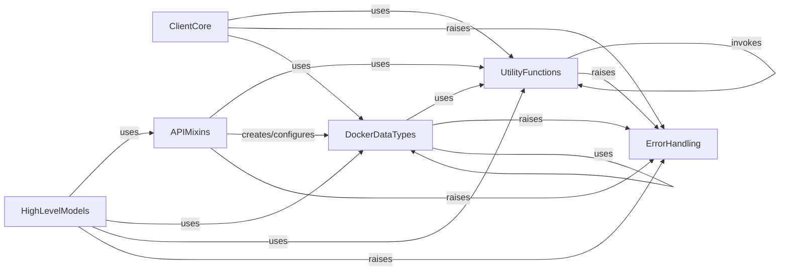

## Component Details

The docker-py library provides a Pythonic interface to the Docker Engine API. The core functionality revolves around the ClientCore component, which establishes and manages connections to the Docker daemon. APIMixins then provide direct interaction with various Docker API endpoints, allowing for operations on containers, images, and volumes. DockerDataTypes define the structured data used for these API interactions, ensuring correct data formatting. UtilityFunctions offer a set of helper functions for common tasks like data parsing, version comparisons, and file handling, supporting both ClientCore and APIMixins. ErrorHandling centralizes custom exceptions for robust error management across the library. Finally, HighLevelModels build upon APIMixins to provide more abstract and user-friendly interfaces for common Docker operations.

### ClientCore
Manages the fundamental connection and configuration with the Docker daemon, including TLS settings, context loading, and establishing communication channels (Unix sockets, Npipe, SSH). It also handles initial server version retrieval and proxy configurations.

**Related Classes/Methods**:

- <a href="https://github.com/docker/docker-py/blob/master/docker/client.py#L48-L100" target="_blank" rel="noopener noreferrer">`docker.client.DockerClient:from_env` (48:100)</a>
- <a href="https://github.com/docker/docker-py/blob/master/docker/tls.py#L21-L55" target="_blank" rel="noopener noreferrer">`docker.tls.TLSConfig:__init__` (21:55)</a>
- <a href="https://github.com/docker/docker-py/blob/master/docker/context/context.py#L120-L144" target="_blank" rel="noopener noreferrer">`docker.context.context.Context:_load_certs` (120:144)</a>
- <a href="https://github.com/docker/docker-py/blob/master/docker/context/config.py#L75-L81" target="_blank" rel="noopener noreferrer">`docker.context.config:get_context_host` (75:81)</a>
- <a href="https://github.com/docker/docker-py/blob/master/docker/api/client.py#L115-L219" target="_blank" rel="noopener noreferrer">`docker.api.client.APIClient:__init__` (115:219)</a>
- <a href="https://github.com/docker/docker-py/blob/master/docker/api/client.py#L355-L374" target="_blank" rel="noopener noreferrer">`docker.api.client.APIClient:_stream_helper` (355:374)</a>
- <a href="https://github.com/docker/docker-py/blob/master/docker/api/client.py#L424-L447" target="_blank" rel="noopener noreferrer">`docker.api.client.APIClient:_read_from_socket` (424:447)</a>
- <a href="https://github.com/docker/docker-py/blob/master/docker/api/client.py#L478-L480" target="_blank" rel="noopener noreferrer">`docker.api.client.APIClient:_check_is_tty` (478:480)</a>

### APIMixins
Provides a structured interface for interacting with various Docker API endpoints. These mixins encapsulate the logic for making API calls related to volumes, plugins, secrets, swarm, services, daemon, build, exec, network, config, containers, and images.

**Related Classes/Methods**:

- <a href="https://github.com/docker/docker-py/blob/master/docker/api/volume.py#L5-L36" target="_blank" rel="noopener noreferrer">`docker.api.volume.VolumeApiMixin:volumes` (5:36)</a>
- <a href="https://github.com/docker/docker-py/blob/master/docker/api/volume.py#L38-L91" target="_blank" rel="noopener noreferrer">`docker.api.volume.VolumeApiMixin:create_volume` (38:91)</a>
- <a href="https://github.com/docker/docker-py/blob/master/docker/api/volume.py#L119-L138" target="_blank" rel="noopener noreferrer">`docker.api.volume.VolumeApiMixin:prune_volumes` (119:138)</a>
- <a href="https://github.com/docker/docker-py/blob/master/docker/api/volume.py#L140-L163" target="_blank" rel="noopener noreferrer">`docker.api.volume.VolumeApiMixin:remove_volume` (140:163)</a>
- <a href="https://github.com/docker/docker-py/blob/master/docker/api/plugin.py#L7-L25" target="_blank" rel="noopener noreferrer">`docker.api.plugin.PluginApiMixin:configure_plugin` (7:25)</a>
- <a href="https://github.com/docker/docker-py/blob/master/docker/api/plugin.py#L28-L51" target="_blank" rel="noopener noreferrer">`docker.api.plugin.PluginApiMixin:create_plugin` (28:51)</a>
- <a href="https://github.com/docker/docker-py/blob/master/docker/api/plugin.py#L54-L69" target="_blank" rel="noopener noreferrer">`docker.api.plugin.PluginApiMixin:disable_plugin` (54:69)</a>
- <a href="https://github.com/docker/docker-py/blob/master/docker/api/plugin.py#L72-L88" target="_blank" rel="noopener noreferrer">`docker.api.plugin.PluginApiMixin:enable_plugin` (72:88)</a>
- <a href="https://github.com/docker/docker-py/blob/master/docker/api/plugin.py#L91-L103" target="_blank" rel="noopener noreferrer">`docker.api.plugin.PluginApiMixin:inspect_plugin` (91:103)</a>
- <a href="https://github.com/docker/docker-py/blob/master/docker/api/plugin.py#L144-L152" target="_blank" rel="noopener noreferrer">`docker.api.plugin.PluginApiMixin:plugins` (144:152)</a>
- <a href="https://github.com/docker/docker-py/blob/master/docker/api/plugin.py#L185-L205" target="_blank" rel="noopener noreferrer">`docker.api.plugin.PluginApiMixin:push_plugin` (185:205)</a>
- <a href="https://github.com/docker/docker-py/blob/master/docker/api/plugin.py#L209-L225" target="_blank" rel="noopener noreferrer">`docker.api.plugin.PluginApiMixin:remove_plugin` (209:225)</a>
- <a href="https://github.com/docker/docker-py/blob/master/docker/api/plugin.py#L229-L261" target="_blank" rel="noopener noreferrer">`docker.api.plugin.PluginApiMixin:upgrade_plugin` (229:261)</a>
- <a href="https://github.com/docker/docker-py/blob/master/docker/api/secret.py#L8-L43" target="_blank" rel="noopener noreferrer">`docker.api.secret.SecretApiMixin:create_secret` (8:43)</a>
- <a href="https://github.com/docker/docker-py/blob/master/docker/api/secret.py#L47-L61" target="_blank" rel="noopener noreferrer">`docker.api.secret.SecretApiMixin:inspect_secret` (47:61)</a>
- <a href="https://github.com/docker/docker-py/blob/master/docker/api/secret.py#L65-L81" target="_blank" rel="noopener noreferrer">`docker.api.secret.SecretApiMixin:remove_secret` (65:81)</a>
- <a href="https://github.com/docker/docker-py/blob/master/docker/api/secret.py#L84-L98" target="_blank" rel="noopener noreferrer">`docker.api.secret.SecretApiMixin:secrets` (84:98)</a>
- <a href="https://github.com/docker/docker-py/blob/master/docker/api/swarm.py#L12-L71" target="_blank" rel="noopener noreferrer">`docker.api.swarm.SwarmApiMixin:create_swarm_spec` (12:71)</a>
- <a href="https://github.com/docker/docker-py/blob/master/docker/api/swarm.py#L74-L81" target="_blank" rel="noopener noreferrer">`docker.api.swarm.SwarmApiMixin:get_unlock_key` (74:81)</a>
- <a href="https://github.com/docker/docker-py/blob/master/docker/api/swarm.py#L84-L180" target="_blank" rel="noopener noreferrer">`docker.api.swarm.SwarmApiMixin:init_swarm` (84:180)</a>
- <a href="https://github.com/docker/docker-py/blob/master/docker/api/swarm.py#L183-L195" target="_blank" rel="noopener noreferrer">`docker.api.swarm.SwarmApiMixin:inspect_swarm` (183:195)</a>
- <a href="https://github.com/docker/docker-py/blob/master/docker/api/swarm.py#L199-L214" target="_blank" rel="noopener noreferrer">`docker.api.swarm.SwarmApiMixin:inspect_node` (199:214)</a>
- <a href="https://github.com/docker/docker-py/blob/master/docker/api/swarm.py#L217-L265" target="_blank" rel="noopener noreferrer">`docker.api.swarm.SwarmApiMixin:join_swarm` (217:265)</a>
- <a href="https://github.com/docker/docker-py/blob/master/docker/api/swarm.py#L268-L293" target="_blank" rel="noopener noreferrer">`docker.api.swarm.SwarmApiMixin:leave_swarm` (268:293)</a>
- <a href="https://github.com/docker/docker-py/blob/master/docker/api/swarm.py#L296-L317" target="_blank" rel="noopener noreferrer">`docker.api.swarm.SwarmApiMixin:nodes` (296:317)</a>
- <a href="https://github.com/docker/docker-py/blob/master/docker/api/swarm.py#L321-L344" target="_blank" rel="noopener noreferrer">`docker.api.swarm.SwarmApiMixin:remove_node` (321:344)</a>
- <a href="https://github.com/docker/docker-py/blob/master/docker/api/swarm.py#L347-L380" target="_blank" rel="noopener noreferrer">`docker.api.swarm.SwarmApiMixin:unlock_swarm` (347:380)</a>
- <a href="https://github.com/docker/docker-py/blob/master/docker/api/swarm.py#L383-L416" target="_blank" rel="noopener noreferrer">`docker.api.swarm.SwarmApiMixin:update_node` (383:416)</a>
- <a href="https://github.com/docker/docker-py/blob/master/docker/api/swarm.py#L419-L462" target="_blank" rel="noopener noreferrer">`docker.api.swarm.SwarmApiMixin:update_swarm` (419:462)</a>
- <a href="https://github.com/docker/docker-py/blob/master/docker/api/service.py#L5-L96" target="_blank" rel="noopener noreferrer">`docker.api.service._check_api_features` (5:96)</a>
- <a href="https://github.com/docker/docker-py/blob/master/docker/api/service.py#L116-L189" target="_blank" rel="noopener noreferrer">`docker.api.service.ServiceApiMixin:create_service` (116:189)</a>
- <a href="https://github.com/docker/docker-py/blob/master/docker/api/service.py#L193-L219" target="_blank" rel="noopener noreferrer">`docker.api.service.ServiceApiMixin:inspect_service` (193:219)</a>
- <a href="https://github.com/docker/docker-py/blob/master/docker/api/service.py#L223-L238" target="_blank" rel="noopener noreferrer">`docker.api.service.ServiceApiMixin:inspect_task` (223:238)</a>
- <a href="https://github.com/docker/docker-py/blob/master/docker/api/service.py#L242-L260" target="_blank" rel="noopener noreferrer">`docker.api.service.ServiceApiMixin:remove_service` (242:260)</a>
- <a href="https://github.com/docker/docker-py/blob/master/docker/api/service.py#L263-L291" target="_blank" rel="noopener noreferrer">`docker.api.service.ServiceApiMixin:services` (263:291)</a>
- <a href="https://github.com/docker/docker-py/blob/master/docker/api/service.py#L344-L365" target="_blank" rel="noopener noreferrer">`docker.api.service.ServiceApiMixin:tasks` (344:365)</a>
- <a href="https://github.com/docker/docker-py/blob/master/docker/api/service.py#L369-L486" target="_blank" rel="noopener noreferrer">`docker.api.service.ServiceApiMixin:update_service` (369:486)</a>
- <a href="https://github.com/docker/docker-py/blob/master/docker/api/daemon.py#L9-L22" target="_blank" rel="noopener noreferrer">`docker.api.daemon.DaemonApiMixin:df` (9:22)</a>
- <a href="https://github.com/docker/docker-py/blob/master/docker/api/daemon.py#L24-L81" target="_blank" rel="noopener noreferrer">`docker.api.daemon.DaemonApiMixin:events` (24:81)</a>
- <a href="https://github.com/docker/docker-py/blob/master/docker/api/build.py#L12-L275" target="_blank" rel="noopener noreferrer">`docker.api.build.BuildApiMixin:build` (12:275)</a>
- <a href="https://github.com/docker/docker-py/blob/master/docker/api/build.py#L278-L319" target="_blank" rel="noopener noreferrer">`docker.api.build.BuildApiMixin:prune_builds` (278:319)</a>
- <a href="https://github.com/docker/docker-py/blob/master/docker/api/exec_api.py#L7-L78" target="_blank" rel="noopener noreferrer">`docker.api.exec_api.ExecApiMixin:exec_create` (7:78)</a>
- <a href="https://github.com/docker/docker-py/blob/master/docker/api/exec_api.py#L118-L176" target="_blank" rel="noopener noreferrer">`docker.api.exec_api.ExecApiMixin:exec_start` (118:176)</a>
- <a href="https://github.com/docker/docker-py/blob/master/docker/api/network.py#L7-L38" target="_blank" rel="noopener noreferrer">`docker.api.network.NetworkApiMixin:networks` (7:38)</a>
- <a href="https://github.com/docker/docker-py/blob/master/docker/api/network.py#L40-L152" target="_blank" rel="noopener noreferrer">`docker.api.network.NetworkApiMixin:create_network` (40:152)</a>
- <a href="https://github.com/docker/docker-py/blob/master/docker/api/network.py#L155-L174" target="_blank" rel="noopener noreferrer">`docker.api.network.NetworkApiMixin:prune_networks` (155:174)</a>
- <a href="https://github.com/docker/docker-py/blob/master/docker/api/network.py#L189-L212" target="_blank" rel="noopener noreferrer">`docker.api.network.NetworkApiMixin:inspect_network` (189:212)</a>
- <a href="https://github.com/docker/docker-py/blob/master/docker/api/network.py#L256-L277" target="_blank" rel="noopener noreferrer">`docker.api.network.NetworkApiMixin:disconnect_container_from_network` (256:277)</a>
- <a href="https://github.com/docker/docker-py/blob/master/docker/api/config.py#L8-L37" target="_blank" rel="noopener noreferrer">`docker.api.config.ConfigApiMixin:create_config` (8:37)</a>
- <a href="https://github.com/docker/docker-py/blob/master/docker/api/config.py#L41-L55" target="_blank" rel="noopener noreferrer">`docker.api.config.ConfigApiMixin:inspect_config` (41:55)</a>
- <a href="https://github.com/docker/docker-py/blob/master/docker/api/config.py#L59-L75" target="_blank" rel="noopener noreferrer">`docker.api.config.ConfigApiMixin:remove_config` (59:75)</a>
- <a href="https://github.com/docker/docker-py/blob/master/docker/api/config.py#L78-L92" target="_blank" rel="noopener noreferrer">`docker.api.config.ConfigApiMixin:configs` (78:92)</a>
- <a href="https://github.com/docker/docker-py/blob/master/docker/api/container.py#L16-L67" target="_blank" rel="noopener noreferrer">`docker.api.container.ContainerApiMixin:attach` (16:67)</a>
- <a href="https://github.com/docker/docker-py/blob/master/docker/api/container.py#L115-L150" target="_blank" rel="noopener noreferrer">`docker.api.container.ContainerApiMixin:commit` (115:150)</a>
- <a href="https://github.com/docker/docker-py/blob/master/docker/api/container.py#L152-L219" target="_blank" rel="noopener noreferrer">`docker.api.container.ContainerApiMixin:containers` (152:219)</a>
- <a href="https://github.com/docker/docker-py/blob/master/docker/api/container.py#L221-L440" target="_blank" rel="noopener noreferrer">`docker.api.container.ContainerApiMixin:create_container` (221:440)</a>
- <a href="https://github.com/docker/docker-py/blob/master/docker/api/container.py#L442-L443" target="_blank" rel="noopener noreferrer">`docker.api.container.ContainerApiMixin:create_container_config` (442:443)</a>
- <a href="https://github.com/docker/docker-py/blob/master/docker/api/container.py#L445-L457" target="_blank" rel="noopener noreferrer">`docker.api.container.ContainerApiMixin:create_container_from_config` (445:457)</a>
- <a href="https://github.com/docker/docker-py/blob/master/docker/api/container.py#L459-L617" target="_blank" rel="noopener noreferrer">`docker.api.container.ContainerApiMixin:create_host_config` (459:617)</a>
- <a href="https://github.com/docker/docker-py/blob/master/docker/api/container.py#L619-L643" target="_blank" rel="noopener noreferrer">`docker.api.container.ContainerApiMixin:create_networking_config` (619:643)</a>
- <a href="https://github.com/docker/docker-py/blob/master/docker/api/container.py#L645-L679" target="_blank" rel="noopener noreferrer">`docker.api.container.ContainerApiMixin:create_endpoint_config` (645:679)</a>
- <a href="https://github.com/docker/docker-py/blob/master/docker/api/container.py#L682-L699" target="_blank" rel="noopener noreferrer">`docker.api.container.ContainerApiMixin:diff` (682:699)</a>
- <a href="https://github.com/docker/docker-py/blob/master/docker/api/container.py#L702-L722" target="_blank" rel="noopener noreferrer">`docker.api.container.ContainerApiMixin:export` (702:722)</a>
- <a href="https://github.com/docker/docker-py/blob/master/docker/api/container.py#L725-L775" target="_blank" rel="noopener noreferrer">`docker.api.container.ContainerApiMixin:get_archive` (725:775)</a>
- <a href="https://github.com/docker/docker-py/blob/master/docker/api/container.py#L778-L795" target="_blank" rel="noopener noreferrer">`docker.api.container.ContainerApiMixin:inspect_container` (778:795)</a>
- <a href="https://github.com/docker/docker-py/blob/master/docker/api/container.py#L798-L818" target="_blank" rel="noopener noreferrer">`docker.api.container.ContainerApiMixin:kill` (798:818)</a>
- <a href="https://github.com/docker/docker-py/blob/master/docker/api/container.py#L821-L901" target="_blank" rel="noopener noreferrer">`docker.api.container.ContainerApiMixin:logs` (821:901)</a>
- <a href="https://github.com/docker/docker-py/blob/master/docker/api/container.py#L904-L917" target="_blank" rel="noopener noreferrer">`docker.api.container.ContainerApiMixin:pause` (904:917)</a>
- <a href="https://github.com/docker/docker-py/blob/master/docker/api/container.py#L920-L967" target="_blank" rel="noopener noreferrer">`docker.api.container.ContainerApiMixin:port` (920:967)</a>
- <a href="https://github.com/docker/docker-py/blob/master/docker/api/container.py#L970-L992" target="_blank" rel="noopener noreferrer">`docker.api.container.ContainerApiMixin:put_archive` (970:992)</a>
- <a href="https://github.com/docker/docker-py/blob/master/docker/api/container.py#L995-L1014" target="_blank" rel="noopener noreferrer">`docker.api.container.ContainerApiMixin:prune_containers` (995:1014)</a>
- <a href="https://github.com/docker/docker-py/blob/master/docker/api/container.py#L1017-L1037" target="_blank" rel="noopener noreferrer">`docker.api.container.ContainerApiMixin:remove_container` (1017:1037)</a>
- <a href="https://github.com/docker/docker-py/blob/master/docker/api/container.py#L1040-L1055" target="_blank" rel="noopener noreferrer">`docker.api.container.ContainerApiMixin:rename` (1040:1055)</a>
- <a href="https://github.com/docker/docker-py/blob/master/docker/api/container.py#L1058-L1074" target="_blank" rel="noopener noreferrer">`docker.api.container.ContainerApiMixin:resize` (1058:1074)</a>
- <a href="https://github.com/docker/docker-py/blob/master/docker/api/container.py#L1077-L1098" target="_blank" rel="noopener noreferrer">`docker.api.container.ContainerApiMixin:restart` (1077:1098)</a>
- <a href="https://github.com/docker/docker-py/blob/master/docker/api/container.py#L1101-L1136" target="_blank" rel="noopener noreferrer">`docker.api.container.ContainerApiMixin:start` (1101:1136)</a>
- <a href="https://github.com/docker/docker-py/blob/master/docker/api/container.py#L1139-L1184" target="_blank" rel="noopener noreferrer">`docker.api.container.ContainerApiMixin:stats` (1139:1184)</a>
- <a href="https://github.com/docker/docker-py/blob/master/docker/api/container.py#L1187-L1212" target="_blank" rel="noopener noreferrer">`docker.api.container.ContainerApiMixin:stop` (1187:1212)</a>
- <a href="https://github.com/docker/docker-py/blob/master/docker/api/container.py#L1215-L1234" target="_blank" rel="noopener noreferrer">`docker.api.container.ContainerApiMixin:top` (1215:1234)</a>
- <a href="https://github.com/docker/docker-py/blob/master/docker/api/container.py#L1237-L1246" target="_blank" rel="noopener noreferrer">`docker.api.container.ContainerApiMixin:unpause` (1237:1246)</a>
- <a href="https://github.com/docker/docker-py/blob/master/docker/api/container.py#L1250-L1312" target="_blank" rel="noopener noreferrer">`docker.api.container.ContainerApiMixin:update_container` (1250:1312)</a>
- <a href="https://github.com/docker/docker-py/blob/master/docker/api/container.py#L1315-L1348" target="_blank" rel="noopener noreferrer">`docker.api.container.ContainerApiMixin:wait` (1315:1348)</a>
- <a href="https://github.com/docker/docker-py/blob/master/docker/api/image.py#L59-L100" target="_blank" rel="noopener noreferrer">`docker.api.image.ImageApiMixin:images` (59:100)</a>
- <a href="https://github.com/docker/docker-py/blob/master/docker/api/image.py#L291-L324" target="_blank" rel="noopener noreferrer">`docker.api.image.ImageApiMixin:load_image` (291:324)</a>
- <a href="https://github.com/docker/docker-py/blob/master/docker/api/image.py#L327-L349" target="_blank" rel="noopener noreferrer">`docker.api.image.ImageApiMixin:prune_images` (327:349)</a>
- <a href="https://github.com/docker/docker-py/blob/master/docker/api/image.py#L351-L434" target="_blank" rel="noopener noreferrer">`docker.api.image.ImageApiMixin:pull` (351:434)</a>
- <a href="https://github.com/docker/docker-py/blob/master/docker/api/image.py#L436-L500" target="_blank" rel="noopener noreferrer">`docker.api.image.ImageApiMixin:push` (436:500)</a>

### DockerDataTypes
Defines the Python classes and structures that represent various Docker objects and their configurations, such as container host configurations, network endpoint configurations, swarm specifications, and service definitions. These types are used to construct and validate data sent to the Docker API.

**Related Classes/Methods**:

- <a href="https://github.com/docker/docker-py/blob/master/docker/tls.py#L6-L67" target="_blank" rel="noopener noreferrer">`docker.tls.TLSConfig` (6:67)</a>
- <a href="https://github.com/docker/docker-py/blob/master/docker/types/containers.py#L264-L662" target="_blank" rel="noopener noreferrer">`docker.types.containers.HostConfig` (264:662)</a>
- <a href="https://github.com/docker/docker-py/blob/master/docker/types/containers.py#L66-L76" target="_blank" rel="noopener noreferrer">`docker.types.containers.LogConfig:__init__` (66:76)</a>
- <a href="https://github.com/docker/docker-py/blob/master/docker/types/containers.py#L125-L139" target="_blank" rel="noopener noreferrer">`docker.types.containers.Ulimit:__init__` (125:139)</a>
- <a href="https://github.com/docker/docker-py/blob/master/docker/types/containers.py#L187-L221" target="_blank" rel="noopener noreferrer">`docker.types.containers.DeviceRequest:__init__` (187:221)</a>
- <a href="https://github.com/docker/docker-py/blob/master/docker/types/containers.py#L265-L662" target="_blank" rel="noopener noreferrer">`docker.types.containers.HostConfig:__init__` (265:662)</a>
- <a href="https://github.com/docker/docker-py/blob/master/docker/types/containers.py#L672-L676" target="_blank" rel="noopener noreferrer">`docker.types.containers:host_config_version_error` (672:676)</a>
- <a href="https://github.com/docker/docker-py/blob/master/docker/types/containers.py#L682-L685" target="_blank" rel="noopener noreferrer">`docker.types.containers:host_config_incompatible_error` (682:685)</a>
- <a href="https://github.com/docker/docker-py/blob/master/docker/types/containers.py#L689-L790" target="_blank" rel="noopener noreferrer">`docker.types.containers.ContainerConfig:__init__` (689:790)</a>
- <a href="https://github.com/docker/docker-py/blob/master/docker/types/swarm.py#L11-L94" target="_blank" rel="noopener noreferrer">`docker.types.swarm.SwarmSpec:__init__` (11:94)</a>
- <a href="https://github.com/docker/docker-py/blob/master/docker/types/healthcheck.py#L30-L46" target="_blank" rel="noopener noreferrer">`docker.types.healthcheck.Healthcheck:__init__` (30:46)</a>
- <a href="https://github.com/docker/docker-py/blob/master/docker/types/daemon.py#L37-L71" target="_blank" rel="noopener noreferrer">`docker.types.daemon.CancellableStream:close` (37:71)</a>
- <a href="https://github.com/docker/docker-py/blob/master/docker/types/networks.py#L6-L51" target="_blank" rel="noopener noreferrer">`docker.types.networks.EndpointConfig:__init__` (6:51)</a>
- <a href="https://github.com/docker/docker-py/blob/master/docker/types/services.py#L37-L57" target="_blank" rel="noopener noreferrer">`docker.types.services.TaskTemplate:__init__` (37:57)</a>
- <a href="https://github.com/docker/docker-py/blob/master/docker/types/services.py#L126-L218" target="_blank" rel="noopener noreferrer">`docker.types.services.ContainerSpec:__init__` (126:218)</a>
- <a href="https://github.com/docker/docker-py/blob/master/docker/types/services.py#L249-L306" target="_blank" rel="noopener noreferrer">`docker.types.services.Mount:__init__` (249:306)</a>
- <a href="https://github.com/docker/docker-py/blob/master/docker/types/services.py#L309-L330" target="_blank" rel="noopener noreferrer">`docker.types.services.Mount:parse_mount_string` (309:330)</a>
- <a href="https://github.com/docker/docker-py/blob/master/docker/types/services.py#L350-L369" target="_blank" rel="noopener noreferrer">`docker.types.services.Resources:__init__` (350:369)</a>
- <a href="https://github.com/docker/docker-py/blob/master/docker/types/services.py#L372-L395" target="_blank" rel="noopener noreferrer">`docker.types.services:_convert_generic_resources_dict` (372:395)</a>
- <a href="https://github.com/docker/docker-py/blob/master/docker/types/services.py#L421-L451" target="_blank" rel="noopener noreferrer">`docker.types.services.UpdateConfig:__init__` (421:451)</a>
- <a href="https://github.com/docker/docker-py/blob/master/docker/types/services.py#L555-L559" target="_blank" rel="noopener noreferrer">`docker.types.services.EndpointSpec:__init__` (555:559)</a>
- <a href="https://github.com/docker/docker-py/blob/master/docker/types/services.py#L608-L640" target="_blank" rel="noopener noreferrer">`docker.types.services.ServiceMode:__init__` (608:640)</a>
- <a href="https://github.com/docker/docker-py/blob/master/docker/types/services.py#L679-L688" target="_blank" rel="noopener noreferrer">`docker.types.services.SecretReference:__init__` (679:688)</a>
- <a href="https://github.com/docker/docker-py/blob/master/docker/types/services.py#L707-L716" target="_blank" rel="noopener noreferrer">`docker.types.services.ConfigReference:__init__` (707:716)</a>
- <a href="https://github.com/docker/docker-py/blob/master/docker/types/services.py#L735-L752" target="_blank" rel="noopener noreferrer">`docker.types.services.Placement:__init__` (735:752)</a>
- <a href="https://github.com/docker/docker-py/blob/master/docker/types/services.py#L768-L774" target="_blank" rel="noopener noreferrer">`docker.types.services.PlacementPreference:__init__` (768:774)</a>
- <a href="https://github.com/docker/docker-py/blob/master/docker/types/services.py#L821-L848" target="_blank" rel="noopener noreferrer">`docker.types.services.Privileges:__init__` (821:848)</a>

### UtilityFunctions
A comprehensive collection of helper functions that provide common utilities across the docker-py library. This includes functions for parsing various data formats, comparing Docker API versions, handling file system operations for builds, managing network ports, and applying decorators for common checks.

**Related Classes/Methods**:

- <a href="https://github.com/docker/docker-py/blob/master/docker/utils/utils.py#L10-L500" target="_blank" rel="noopener noreferrer">`docker.utils.utils` (10:500)</a>
- <a href="https://github.com/docker/docker-py/blob/master/docker/utils/json_stream.py#L35-L40" target="_blank" rel="noopener noreferrer">`docker.utils.json_stream:json_stream` (35:40)</a>
- <a href="https://github.com/docker/docker-py/blob/master/docker/utils/socket.py#L62-L73" target="_blank" rel="noopener noreferrer">`docker.utils.socket:read_exactly` (62:73)</a>
- <a href="https://github.com/docker/docker-py/blob/master/docker/utils/socket.py#L76-L89" target="_blank" rel="noopener noreferrer">`docker.utils.socket:next_frame_header` (76:89)</a>
- <a href="https://github.com/docker/docker-py/blob/master/docker/utils/socket.py#L92-L103" target="_blank" rel="noopener noreferrer">`docker.utils.socket:frames_iter` (92:103)</a>
- <a href="https://github.com/docker/docker-py/blob/master/docker/utils/socket.py#L106-L124" target="_blank" rel="noopener noreferrer">`docker.utils.socket:frames_iter_no_tty` (106:124)</a>
- <a href="https://github.com/docker/docker-py/blob/master/docker/utils/socket.py#L127-L137" target="_blank" rel="noopener noreferrer">`docker.utils.socket:frames_iter_tty` (127:137)</a>
- <a href="https://github.com/docker/docker-py/blob/master/docker/utils/ports.py#L22-L29" target="_blank" rel="noopener noreferrer">`docker.utils.ports:add_port` (22:29)</a>
- <a href="https://github.com/docker/docker-py/blob/master/docker/utils/ports.py#L32-L37" target="_blank" rel="noopener noreferrer">`docker.utils.ports:build_port_bindings` (32:37)</a>
- <a href="https://github.com/docker/docker-py/blob/master/docker/utils/ports.py#L56-L83" target="_blank" rel="noopener noreferrer">`docker.utils.ports:split_port` (56:83)</a>
- <a href="https://github.com/docker/docker-py/blob/master/docker/utils/fnmatch.py#L26-L44" target="_blank" rel="noopener noreferrer">`docker.utils.fnmatch:fnmatch` (26:44)</a>
- <a href="https://github.com/docker/docker-py/blob/master/docker/utils/fnmatch.py#L47-L60" target="_blank" rel="noopener noreferrer">`docker.utils.fnmatch:fnmatchcase` (47:60)</a>
- <a href="https://github.com/docker/docker-py/blob/master/docker/utils/decorators.py#L7-L21" target="_blank" rel="noopener noreferrer">`docker.utils.decorators:check_resource` (7:21)</a>
- <a href="https://github.com/docker/docker-py/blob/master/docker/utils/decorators.py#L24-L34" target="_blank" rel="noopener noreferrer">`docker.utils.decorators:minimum_version` (24:34)</a>
- <a href="https://github.com/docker/docker-py/blob/master/docker/utils/build.py#L22-L38" target="_blank" rel="noopener noreferrer">`docker.utils.build:tar` (22:38)</a>
- <a href="https://github.com/docker/docker-py/blob/master/docker/utils/build.py#L41-L55" target="_blank" rel="noopener noreferrer">`docker.utils.build:exclude_paths` (41:55)</a>
- <a href="https://github.com/docker/docker-py/blob/master/docker/utils/build.py#L70-L120" target="_blank" rel="noopener noreferrer">`docker.utils.build:create_archive` (70:120)</a>
- <a href="https://github.com/docker/docker-py/blob/master/docker/utils/build.py#L146-L149" target="_blank" rel="noopener noreferrer">`docker.utils.build:normalize_slashes` (146:149)</a>
- <a href="https://github.com/docker/docker-py/blob/master/docker/utils/build.py#L152-L154" target="_blank" rel="noopener noreferrer">`docker.utils.build:walk` (152:154)</a>
- <a href="https://github.com/docker/docker-py/blob/master/docker/utils/build.py#L160-L164" target="_blank" rel="noopener noreferrer">`docker.utils.build.PatternMatcher:__init__` (160:164)</a>
- <a href="https://github.com/docker/docker-py/blob/master/docker/utils/build.py#L166-L183" target="_blank" rel="noopener noreferrer">`docker.utils.build.PatternMatcher:matches` (166:183)</a>
- <a href="https://github.com/docker/docker-py/blob/master/docker/utils/build.py#L185-L219" target="_blank" rel="noopener noreferrer">`docker.utils.build.PatternMatcher:walk` (185:219)</a>
- <a href="https://github.com/docker/docker-py/blob/master/docker/utils/build.py#L223-L230" target="_blank" rel="noopener noreferrer">`docker.utils.build.Pattern:__init__` (223:230)</a>
- <a href="https://github.com/docker/docker-py/blob/master/docker/utils/build.py#L233-L257" target="_blank" rel="noopener noreferrer">`docker.utils.build.Pattern:normalize` (233:257)</a>
- <a href="https://github.com/docker/docker-py/blob/master/docker/utils/build.py#L259-L260" target="_blank" rel="noopener noreferrer">`docker.utils.build.Pattern:match` (259:260)</a>
- <a href="https://github.com/docker/docker-py/blob/master/docker/utils/proxy.py#L25-L38" target="_blank" rel="noopener noreferrer">`docker.utils.proxy.ProxyConfig:from_dict` (25:38)</a>
- <a href="https://github.com/docker/docker-py/blob/master/docker/utils/proxy.py#L56-L69" target="_blank" rel="noopener noreferrer">`docker.utils.proxy.ProxyConfig:inject_proxy_environment` (56:69)</a>
- <a href="https://github.com/docker/docker-py/blob/master/docker/utils/config.py#L13-L30" target="_blank" rel="noopener noreferrer">`docker.utils.config:find_config_file` (13:30)</a>
- <a href="https://github.com/docker/docker-py/blob/master/docker/utils/config.py#L51-L66" target="_blank" rel="noopener noreferrer">`docker.utils.config:load_general_config` (51:66)</a>
- <a href="https://github.com/docker/docker-py/blob/master/docker/utils/json_stream.py#L35-L40" target="_blank" rel="noopener noreferrer">`docker.utils.json_stream:json_stream` (35:40)</a>
- <a href="https://github.com/docker/docker-py/blob/master/docker/utils/json_stream.py#L50-L74" target="_blank" rel="noopener noreferrer">`docker.utils.json_stream:split_buffer` (50:74)</a>
- <a href="https://github.com/docker/docker-py/blob/master/docker/utils/utils.py#L28-L32" target="_blank" rel="noopener noreferrer">`docker.utils.utils:create_ipam_pool` (28:32)</a>
- <a href="https://github.com/docker/docker-py/blob/master/docker/utils/utils.py#L35-L39" target="_blank" rel="noopener noreferrer">`docker.utils.utils:create_ipam_config` (35:39)</a>
- <a href="https://github.com/docker/docker-py/blob/master/docker/utils/utils.py#L77-L78" target="_blank" rel="noopener noreferrer">`docker.utils.utils:version_lt` (77:78)</a>
- <a href="https://github.com/docker/docker-py/blob/master/docker/utils/utils.py#L81-L82" target="_blank" rel="noopener noreferrer">`docker.utils.utils:version_gte` (81:82)</a>
- <a href="https://github.com/docker/docker-py/blob/master/docker/utils/utils.py#L113-L123" target="_blank" rel="noopener noreferrer">`docker.utils.utils:convert_port_bindings` (113:123)</a>
- <a href="https://github.com/docker/docker-py/blob/master/docker/utils/utils.py#L233-L321" target="_blank" rel="noopener noreferrer">`docker.utils.utils:parse_host` (233:321)</a>
- <a href="https://github.com/docker/docker-py/blob/master/docker/utils/utils.py#L324-L350" target="_blank" rel="noopener noreferrer">`docker.utils.utils:parse_devices` (324:350)</a>
- <a href="https://github.com/docker/docker-py/blob/master/docker/utils/utils.py#L353-L388" target="_blank" rel="noopener noreferrer">`docker.utils.utils:kwargs_from_env` (353:388)</a>
- <a href="https://github.com/docker/docker-py/blob/master/docker/utils/utils.py#L411-L448" target="_blank" rel="noopener noreferrer">`docker.utils.utils:parse_bytes` (411:448)</a>
- <a href="https://github.com/docker/docker-py/blob/master/docker/utils/utils.py#L458-L483" target="_blank" rel="noopener noreferrer">`docker.utils.utils:parse_env_file` (458:483)</a>
- <a href="https://github.com/docker/docker-py/blob/master/docker/utils/utils.py#L490-L498" target="_blank" rel="noopener noreferrer">`docker.utils.utils:format_environment` (490:498)</a>
- <a href="https://github.com/docker/docker-py/blob/master/docker/utils/utils.py#L513-L517" target="_blank" rel="noopener noreferrer">`docker.utils.utils:create_host_config` (513:517)</a>

### ErrorHandling
Defines custom exceptions to manage and propagate specific errors encountered during Docker operations. This component centralizes error types, allowing for more granular error handling and clearer communication of issues within the library.

**Related Classes/Methods**:

- <a href="https://github.com/docker/docker-py/blob/master/docker/errors.py#L120-L128" target="_blank" rel="noopener noreferrer">`docker.errors.TLSParameterError` (120:128)</a>
- <a href="https://github.com/docker/docker-py/blob/master/docker/errors.py#L100-L101" target="_blank" rel="noopener noreferrer">`docker.errors.InvalidVersion` (100:101)</a>
- <a href="https://github.com/docker/docker-py/blob/master/docker/errors.py#L112-L113" target="_blank" rel="noopener noreferrer">`docker.errors.InvalidArgument` (112:113)</a>
- <a href="https://github.com/docker/docker-py/blob/master/docker/errors.py#L13-L19" target="_blank" rel="noopener noreferrer">`docker.errors.DockerException` (13:19)</a>
- <a href="https://github.com/docker/docker-py/blob/master/docker/errors.py#L131-L132" target="_blank" rel="noopener noreferrer">`docker.errors.NullResource` (131:132)</a>
- <a href="https://github.com/docker/docker-py/blob/master/docker/errors.py#L116-L117" target="_blank" rel="noopener noreferrer">`docker.errors.DeprecatedMethod` (116:117)</a>
- <a href="https://github.com/docker/docker-py/blob/master/docker/errors.py#L153-L155" target="_blank" rel="noopener noreferrer">`docker.errors.StreamParseError` (153:155)</a>
- <a href="https://github.com/docker/docker-py/blob/master/docker/errors.py#L135-L150" target="_blank" rel="noopener noreferrer">`docker.errors.ContainerError` (135:150)</a>
- <a href="https://github.com/docker/docker-py/blob/master/docker/errors.py#L158-L162" target="_blank" rel="noopener noreferrer">`docker.errors.BuildError` (158:162)</a>

### HighLevelModels
Provides higher-level abstractions and convenience methods for managing Docker resources, building upon the lower-level API Mixins. These models simplify common operations like running containers, building images, and listing networks, offering a more object-oriented interface.

**Related Classes/Methods**:

- <a href="https://github.com/docker/docker-py/blob/master/docker/models/containers.py#L535-L912" target="_blank" rel="noopener noreferrer">`docker.models.containers.ContainerCollection:run` (535:912)</a>
- <a href="https://github.com/docker/docker-py/blob/master/docker/models/containers.py#L1123-L1182" target="_blank" rel="noopener noreferrer">`docker.models.containers:_create_container_args` (1123:1182)</a>
- <a href="https://github.com/docker/docker-py/blob/master/docker/models/images.py#L165-L177" target="_blank" rel="noopener noreferrer">`docker.models.images.RegistryData:pull` (165:177)</a>
- <a href="https://github.com/docker/docker-py/blob/master/docker/models/images.py#L220-L315" target="_blank" rel="noopener noreferrer">`docker.models.images.ImageCollection:build` (220:315)</a>
- <a href="https://github.com/docker/docker-py/blob/master/docker/models/images.py#L415-L475" target="_blank" rel="noopener noreferrer">`docker.models.images.ImageCollection:pull` (415:475)</a>
- <a href="https://github.com/docker/docker-py/blob/master/docker/models/networks.py#L185-L214" target="_blank" rel="noopener noreferrer">`docker.models.networks.NetworkCollection:list` (185:214)</a>

### [FAQ](https://github.com/CodeBoarding/GeneratedOnBoardings/tree/main?tab=readme-ov-file#faq)