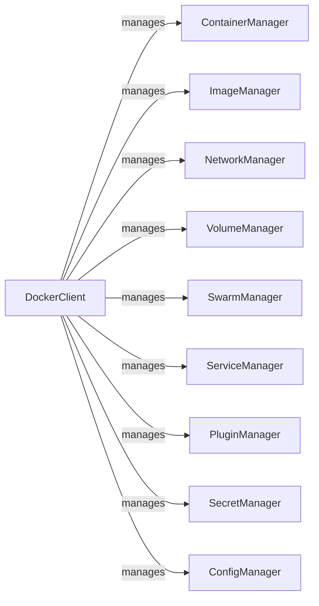

## Component Details

This graph illustrates the architecture of the Docker Resource Management subsystem within the `docker-py` library. The `DockerClient` acts as the central entry point, managing various Docker resources through dedicated manager components such as `ContainerManager`, `ImageManager`, `NetworkManager`, `VolumeManager`, `SwarmManager`, `ServiceManager`, `PluginManager`, `SecretManager`, and `ConfigManager`. Each manager component is responsible for the lifecycle and operations of its specific Docker resource type.

### DockerClient
The primary interface for interacting with the Docker daemon. It provides access to various Docker resources (containers, images, networks, volumes, etc.) through dedicated collection objects.

**Related Classes/Methods**:

- <a href="https://github.com/docker/docker-py/blob/master/docker/client.py#L16-L219" target="_blank" rel="noopener noreferrer">`docker.client.DockerClient` (16:219)</a>

### ContainerManager
Handles operations related to Docker containers, including creation, listing, inspection, starting, stopping, removing, and executing commands within containers. It interacts with the Docker API for container-specific actions.

**Related Classes/Methods**:

- <a href="https://github.com/docker/docker-py/blob/master/docker/api/container.py#L14-L1348" target="_blank" rel="noopener noreferrer">`docker.api.container.ContainerApiMixin` (14:1348)</a>
- <a href="https://github.com/docker/docker-py/blob/master/docker/models/containers.py#L532-L1029" target="_blank" rel="noopener noreferrer">`docker.models.containers.ContainerCollection` (532:1029)</a>
- <a href="https://github.com/docker/docker-py/blob/master/docker/models/containers.py#L20-L529" target="_blank" rel="noopener noreferrer">`docker.models.containers.Container` (20:529)</a>

### ImageManager
Manages Docker images, supporting operations like building, pulling, pushing, listing, inspecting, and removing images. It interacts with the Docker API for image-specific actions and handles image-related data.

**Related Classes/Methods**:

- <a href="https://github.com/docker/docker-py/blob/master/docker/api/image.py#L10-L572" target="_blank" rel="noopener noreferrer">`docker.api.image.ImageApiMixin` (10:572)</a>
- <a href="https://github.com/docker/docker-py/blob/master/docker/models/images.py#L217-L495" target="_blank" rel="noopener noreferrer">`docker.models.images.ImageCollection` (217:495)</a>
- <a href="https://github.com/docker/docker-py/blob/master/docker/models/images.py#L13-L139" target="_blank" rel="noopener noreferrer">`docker.models.images.Image` (13:139)</a>
- <a href="https://github.com/docker/docker-py/blob/master/docker/models/images.py#L142-L214" target="_blank" rel="noopener noreferrer">`docker.models.images.RegistryData` (142:214)</a>

### NetworkManager
Provides functionalities for managing Docker networks, including creating, listing, inspecting, and removing networks, as well as connecting and disconnecting containers from networks.

**Related Classes/Methods**:

- <a href="https://github.com/docker/docker-py/blob/master/docker/api/network.py#L6-L277" target="_blank" rel="noopener noreferrer">`docker.api.network.NetworkApiMixin` (6:277)</a>
- <a href="https://github.com/docker/docker-py/blob/master/docker/models/networks.py#L94-L218" target="_blank" rel="noopener noreferrer">`docker.models.networks.NetworkCollection` (94:218)</a>

### VolumeManager
Manages Docker volumes, enabling operations such as creating, listing, inspecting, and removing volumes.

**Related Classes/Methods**:

- <a href="https://github.com/docker/docker-py/blob/master/docker/api/volume.py#L4-L163" target="_blank" rel="noopener noreferrer">`docker.api.volume.VolumeApiMixin` (4:163)</a>
- <a href="https://github.com/docker/docker-py/blob/master/docker/models/volumes.py#L28-L99" target="_blank" rel="noopener noreferrer">`docker.models.volumes.VolumeCollection` (28:99)</a>

### SwarmManager
Facilitates the management of Docker Swarm, including initializing, joining, leaving, inspecting, and updating swarm nodes and the swarm itself.

**Related Classes/Methods**:

- <a href="https://github.com/docker/docker-py/blob/master/docker/api/swarm.py#L10-L462" target="_blank" rel="noopener noreferrer">`docker.api.swarm.SwarmApiMixin` (10:462)</a>
- <a href="https://github.com/docker/docker-py/blob/master/docker/models/swarm.py#L7-L190" target="_blank" rel="noopener noreferrer">`docker.models.swarm.Swarm` (7:190)</a>

### ServiceManager
Handles Docker Swarm services, allowing for creation, listing, inspection, updating, and removal of services, as well as managing service tasks.

**Related Classes/Methods**:

- <a href="https://github.com/docker/docker-py/blob/master/docker/api/service.py#L114-L486" target="_blank" rel="noopener noreferrer">`docker.api.service.ServiceApiMixin` (114:486)</a>
- <a href="https://github.com/docker/docker-py/blob/master/docker/models/services.py#L146-L284" target="_blank" rel="noopener noreferrer">`docker.models.services.ServiceCollection` (146:284)</a>
- <a href="https://github.com/docker/docker-py/blob/master/docker/models/services.py#L9-L143" target="_blank" rel="noopener noreferrer">`docker.models.services.Service` (9:143)</a>

### PluginManager
Manages Docker plugins, supporting operations like configuring, creating, disabling, enabling, inspecting, pulling, pushing, and removing plugins.

**Related Classes/Methods**:

- <a href="https://github.com/docker/docker-py/blob/master/docker/api/plugin.py#L4-L261" target="_blank" rel="noopener noreferrer">`docker.api.plugin.PluginApiMixin` (4:261)</a>
- <a href="https://github.com/docker/docker-py/blob/master/docker/models/plugins.py#L131-L206" target="_blank" rel="noopener noreferrer">`docker.models.plugins.PluginCollection` (131:206)</a>
- <a href="https://github.com/docker/docker-py/blob/master/docker/models/plugins.py#L5-L128" target="_blank" rel="noopener noreferrer">`docker.models.plugins.Plugin` (5:128)</a>

### SecretManager
Manages Docker secrets, providing functionalities for creating, inspecting, and removing secrets within a Docker Swarm.

**Related Classes/Methods**:

- <a href="https://github.com/docker/docker-py/blob/master/docker/api/secret.py#L6-L98" target="_blank" rel="noopener noreferrer">`docker.api.secret.SecretApiMixin` (6:98)</a>
- <a href="https://github.com/docker/docker-py/blob/master/docker/models/secrets.py#L27-L70" target="_blank" rel="noopener noreferrer">`docker.models.secrets.SecretCollection` (27:70)</a>

### ConfigManager
Manages Docker configurations (configs), allowing for creation, inspection, and removal of configurations within a Docker Swarm.

**Related Classes/Methods**:

- <a href="https://github.com/docker/docker-py/blob/master/docker/api/config.py#L6-L92" target="_blank" rel="noopener noreferrer">`docker.api.config.ConfigApiMixin` (6:92)</a>
- <a href="https://github.com/docker/docker-py/blob/master/docker/models/configs.py#L27-L70" target="_blank" rel="noopener noreferrer">`docker.models.configs.ConfigCollection` (27:70)</a>

### [FAQ](https://github.com/CodeBoarding/GeneratedOnBoardings/tree/main?tab=readme-ov-file#faq)