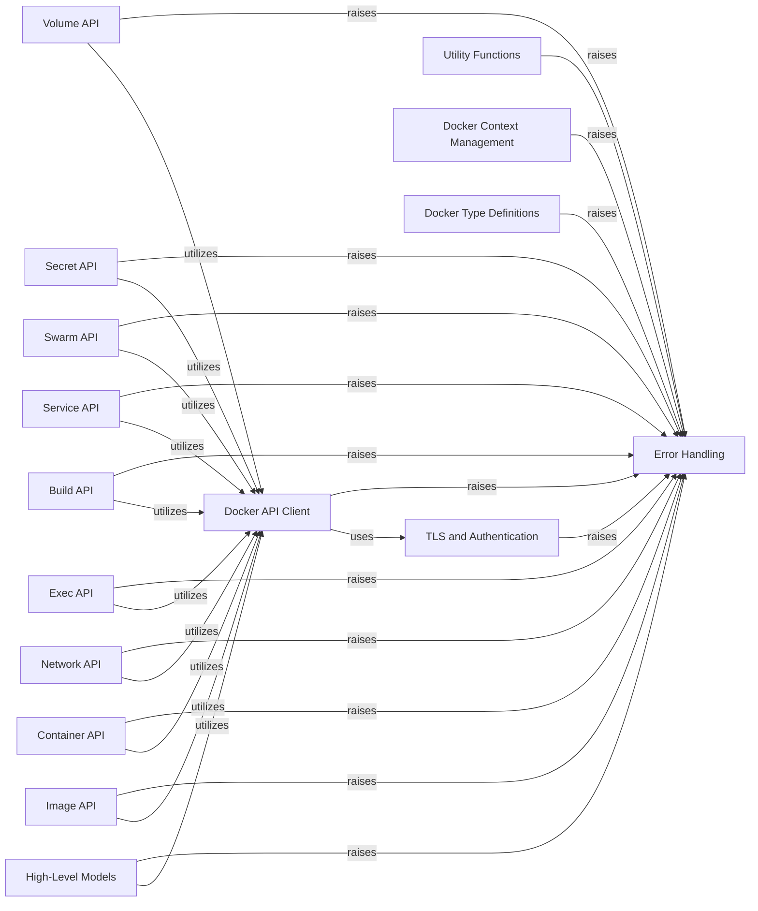

## Component Details

This graph illustrates the architecture of the Docker SDK for Python, focusing on its core components and their interactions. The system is designed around a central `Docker API Client` that facilitates communication with the Docker daemon. Various API-specific components (e.g., `Volume API`, `Container API`) utilize this client to perform Docker operations. Error handling is centralized in the `Error Handling` component, which is raised by almost all other components to provide structured error reporting. High-level models offer a more user-friendly interface, abstracting away some of the lower-level API calls. Utility functions provide common helper methods, and TLS and authentication components ensure secure communication. Context management allows switching between different Docker environments.

### Error Handling
This component centralizes the definition and creation of various exceptions and errors within the `docker` library. It provides specific error types for different failure scenarios, such as invalid parameters, API errors, and configuration issues, ensuring consistent error reporting across the system.

**Related Classes/Methods**:

- <a href="https://github.com/docker/docker-py/blob/master/docker/errors.py#L13-L19" target="_blank" rel="noopener noreferrer">`docker.errors.DockerException` (13:19)</a>
- <a href="https://github.com/docker/docker-py/blob/master/docker/errors.py#L22-L39" target="_blank" rel="noopener noreferrer">`docker.errors.create_api_error_from_http_exception` (22:39)</a>
- <a href="https://github.com/docker/docker-py/blob/master/docker/errors.py#L42-L89" target="_blank" rel="noopener noreferrer">`docker.errors.APIError` (42:89)</a>
- <a href="https://github.com/docker/docker-py/blob/master/docker/errors.py#L81-L84" target="_blank" rel="noopener noreferrer">`docker.errors.APIError.is_client_error` (81:84)</a>
- <a href="https://github.com/docker/docker-py/blob/master/docker/errors.py#L86-L89" target="_blank" rel="noopener noreferrer">`docker.errors.APIError.is_server_error` (86:89)</a>
- <a href="https://github.com/docker/docker-py/blob/master/docker/errors.py#L92-L93" target="_blank" rel="noopener noreferrer">`docker.errors.NotFound` (92:93)</a>
- <a href="https://github.com/docker/docker-py/blob/master/docker/errors.py#L96-L97" target="_blank" rel="noopener noreferrer">`docker.errors.ImageNotFound` (96:97)</a>
- <a href="https://github.com/docker/docker-py/blob/master/docker/errors.py#L100-L101" target="_blank" rel="noopener noreferrer">`docker.errors.InvalidVersion` (100:101)</a>
- <a href="https://github.com/docker/docker-py/blob/master/docker/errors.py#L104-L105" target="_blank" rel="noopener noreferrer">`docker.errors.InvalidRepository` (104:105)</a>
- <a href="https://github.com/docker/docker-py/blob/master/docker/errors.py#L108-L109" target="_blank" rel="noopener noreferrer">`docker.errors.InvalidConfigFile` (108:109)</a>
- <a href="https://github.com/docker/docker-py/blob/master/docker/errors.py#L112-L113" target="_blank" rel="noopener noreferrer">`docker.errors.InvalidArgument` (112:113)</a>
- <a href="https://github.com/docker/docker-py/blob/master/docker/errors.py#L116-L117" target="_blank" rel="noopener noreferrer">`docker.errors.DeprecatedMethod` (116:117)</a>
- <a href="https://github.com/docker/docker-py/blob/master/docker/errors.py#L120-L128" target="_blank" rel="noopener noreferrer">`docker.errors.TLSParameterError` (120:128)</a>
- <a href="https://github.com/docker/docker-py/blob/master/docker/errors.py#L131-L132" target="_blank" rel="noopener noreferrer">`docker.errors.NullResource` (131:132)</a>
- <a href="https://github.com/docker/docker-py/blob/master/docker/errors.py#L135-L150" target="_blank" rel="noopener noreferrer">`docker.errors.ContainerError` (135:150)</a>
- <a href="https://github.com/docker/docker-py/blob/master/docker/errors.py#L153-L155" target="_blank" rel="noopener noreferrer">`docker.errors.StreamParseError` (153:155)</a>
- <a href="https://github.com/docker/docker-py/blob/master/docker/errors.py#L158-L162" target="_blank" rel="noopener noreferrer">`docker.errors.BuildError` (158:162)</a>
- <a href="https://github.com/docker/docker-py/blob/master/docker/errors.py#L165-L166" target="_blank" rel="noopener noreferrer">`docker.errors.ImageLoadError` (165:166)</a>
- <a href="https://github.com/docker/docker-py/blob/master/docker/errors.py#L169-L177" target="_blank" rel="noopener noreferrer">`docker.errors.create_unexpected_kwargs_error` (169:177)</a>
- <a href="https://github.com/docker/docker-py/blob/master/docker/errors.py#L180-L185" target="_blank" rel="noopener noreferrer">`docker.errors.MissingContextParameter` (180:185)</a>
- <a href="https://github.com/docker/docker-py/blob/master/docker/errors.py#L188-L193" target="_blank" rel="noopener noreferrer">`docker.errors.ContextAlreadyExists` (188:193)</a>
- <a href="https://github.com/docker/docker-py/blob/master/docker/errors.py#L196-L201" target="_blank" rel="noopener noreferrer">`docker.errors.ContextException` (196:201)</a>
- <a href="https://github.com/docker/docker-py/blob/master/docker/errors.py#L204-L209" target="_blank" rel="noopener noreferrer">`docker.errors.ContextNotFound` (204:209)</a>
- <a href="https://github.com/docker/docker-py/blob/master/docker/credentials/errors.py#L1-L2" target="_blank" rel="noopener noreferrer">`docker.credentials.errors.StoreError` (1:2)</a>
- <a href="https://github.com/docker/docker-py/blob/master/docker/credentials/errors.py#L5-L6" target="_blank" rel="noopener noreferrer">`docker.credentials.errors.CredentialsNotFound` (5:6)</a>
- <a href="https://github.com/docker/docker-py/blob/master/docker/utils/socket.py#L17-L18" target="_blank" rel="noopener noreferrer">`docker.utils.socket.SocketError` (17:18)</a>
- <a href="https://github.com/docker/docker-py/blob/master/docker/types/containers.py#L665-L669" target="_blank" rel="noopener noreferrer">`docker.types.containers.host_config_type_error` (665:669)</a>
- <a href="https://github.com/docker/docker-py/blob/master/docker/types/containers.py#L678-L679" target="_blank" rel="noopener noreferrer">`docker.types.containers.host_config_value_error` (678:679)</a>
- <a href="https://github.com/docker/docker-py/blob/master/docker/types/containers.py#L672-L676" target="_blank" rel="noopener noreferrer">`docker.types.containers.host_config_version_error` (672:676)</a>
- <a href="https://github.com/docker/docker-py/blob/master/docker/types/containers.py#L682-L685" target="_blank" rel="noopener noreferrer">`docker.types.containers.host_config_incompatible_error` (682:685)</a>

### TLS and Authentication
This component manages secure communication configurations, including TLS parameters and user authentication details. It handles the parsing of authentication configurations and resolves repository authentication, ensuring secure access to Docker registries and daemons.

**Related Classes/Methods**:

- <a href="https://github.com/docker/docker-py/blob/master/docker/tls.py#L21-L55" target="_blank" rel="noopener noreferrer">`docker.tls.TLSConfig:__init__` (21:55)</a>
- `docker.auth:resolve_` (full file reference)
- <a href="https://github.com/docker/docker-py/blob/master/docker/auth.py#L84-L141" target="_blank" rel="noopener noreferrer">`docker.auth.AuthConfig:parse_auth` (84:141)</a>
- <a href="https://github.com/docker/docker-py/blob/master/docker/auth.py#L244-L270" target="_blank" rel="noopener noreferrer">`docker.auth.AuthConfig:_resolve_authconfig_credstore` (244:270)</a>
- <a href="https://github.com/docker/docker-py/blob/master/docker/auth.py#L352-L378" target="_blank" rel="noopener noreferrer">`docker.auth:_load_legacy_config` (352:378)</a>
- <a href="https://github.com/docker/docker-py/blob/master/docker/credentials/store.py#L71-L93" target="_blank" rel="noopener noreferrer">`docker.credentials.store.Store:_execute` (71:93)</a>
- <a href="https://github.com/docker/docker-py/blob/master/docker/credentials/errors.py#L13-L17" target="_blank" rel="noopener noreferrer">`docker.credentials.errors:process_store_error` (13:17)</a>

### Utility Functions
This component provides a collection of helper functions for common tasks such as socket operations, resource validation, version checking, JSON stream parsing, and various data parsing utilities. It aims to encapsulate reusable logic and simplify interactions with Docker-related data.

**Related Classes/Methods**:

- <a href="https://github.com/docker/docker-py/blob/master/docker/utils/socket.py#L62-L73" target="_blank" rel="noopener noreferrer">`docker.utils.socket:read_exactly` (62:73)</a>
- <a href="https://github.com/docker/docker-py/blob/master/docker/utils/decorators.py#L7-L21" target="_blank" rel="noopener noreferrer">`docker.utils.decorators:check_resource` (7:21)</a>
- <a href="https://github.com/docker/docker-py/blob/master/docker/utils/decorators.py#L24-L34" target="_blank" rel="noopener noreferrer">`docker.utils.decorators:minimum_version` (24:34)</a>
- <a href="https://github.com/docker/docker-py/blob/master/docker/utils/json_stream.py#L50-L74" target="_blank" rel="noopener noreferrer">`docker.utils.json_stream:split_buffer` (50:74)</a>
- <a href="https://github.com/docker/docker-py/blob/master/docker/utils/utils.py#L28-L32" target="_blank" rel="noopener noreferrer">`docker.utils.utils:create_ipam_pool` (28:32)</a>
- <a href="https://github.com/docker/docker-py/blob/master/docker/utils/utils.py#L35-L39" target="_blank" rel="noopener noreferrer">`docker.utils.utils:create_ipam_config` (35:39)</a>
- <a href="https://github.com/docker/docker-py/blob/master/docker/utils/utils.py#L233-L321" target="_blank" rel="noopener noreferrer">`docker.utils.utils:parse_host` (233:321)</a>
- <a href="https://github.com/docker/docker-py/blob/master/docker/utils/utils.py#L324-L350" target="_blank" rel="noopener noreferrer">`docker.utils.utils:parse_devices` (324:350)</a>
- <a href="https://github.com/docker/docker-py/blob/master/docker/utils/utils.py#L411-L448" target="_blank" rel="noopener noreferrer">`docker.utils.utils:parse_bytes` (411:448)</a>
- <a href="https://github.com/docker/docker-py/blob/master/docker/utils/utils.py#L458-L483" target="_blank" rel="noopener noreferrer">`docker.utils.utils:parse_env_file` (458:483)</a>
- <a href="https://github.com/docker/docker-py/blob/master/docker/utils/utils.py#L513-L517" target="_blank" rel="noopener noreferrer">`docker.utils.utils:create_host_config` (513:517)</a>

### Docker Context Management
This component is responsible for managing Docker contexts, which define connection parameters to Docker daemons. It provides functionalities to create, set, remove, and inspect contexts, allowing users to easily switch between different Docker environments.

**Related Classes/Methods**:

- <a href="https://github.com/docker/docker-py/blob/master/docker/context/context.py#L19-L60" target="_blank" rel="noopener noreferrer">`docker.context.context.Context:__init__` (19:60)</a>
- <a href="https://github.com/docker/docker-py/blob/master/docker/context/api.py#L23-L70" target="_blank" rel="noopener noreferrer">`docker.context.api.ContextAPI:create_context` (23:70)</a>
- <a href="https://github.com/docker/docker-py/blob/master/docker/context/api.py#L136-L144" target="_blank" rel="noopener noreferrer">`docker.context.api.ContextAPI:set_current_context` (136:144)</a>
- <a href="https://github.com/docker/docker-py/blob/master/docker/context/api.py#L147-L177" target="_blank" rel="noopener noreferrer">`docker.context.api.ContextAPI:remove_context` (147:177)</a>
- <a href="https://github.com/docker/docker-py/blob/master/docker/context/api.py#L180-L206" target="_blank" rel="noopener noreferrer">`docker.context.api.ContextAPI:inspect_context` (180:206)</a>

### Docker Type Definitions
This component defines various data structures and classes that represent Docker objects and configurations, such as host configurations, container configurations, swarm specifications, network endpoint configurations, and service-related types like mounts and update policies. It ensures proper data validation and structure for interacting with the Docker API.

**Related Classes/Methods**:

- <a href="https://github.com/docker/docker-py/blob/master/docker/types/containers.py#L265-L662" target="_blank" rel="noopener noreferrer">`docker.types.containers.HostConfig:__init__` (265:662)</a>
- <a href="https://github.com/docker/docker-py/blob/master/docker/types/containers.py#L672-L676" target="_blank" rel="noopener noreferrer">`docker.types.containers:host_config_version_error` (672:676)</a>
- <a href="https://github.com/docker/docker-py/blob/master/docker/types/containers.py#L682-L685" target="_blank" rel="noopener noreferrer">`docker.types.containers:host_config_incompatible_error` (682:685)</a>
- <a href="https://github.com/docker/docker-py/blob/master/docker/types/containers.py#L689-L790" target="_blank" rel="noopener noreferrer">`docker.types.containers.ContainerConfig:__init__` (689:790)</a>
- <a href="https://github.com/docker/docker-py/blob/master/docker/types/swarm.py#L11-L94" target="_blank" rel="noopener noreferrer">`docker.types.swarm.SwarmSpec:__init__` (11:94)</a>
- <a href="https://github.com/docker/docker-py/blob/master/docker/types/daemon.py#L37-L71" target="_blank" rel="noopener noreferrer">`docker.types.daemon.CancellableStream:close` (37:71)</a>
- <a href="https://github.com/docker/docker-py/blob/master/docker/types/networks.py#L6-L51" target="_blank" rel="noopener noreferrer">`docker.types.networks.EndpointConfig:__init__` (6:51)</a>
- <a href="https://github.com/docker/docker-py/blob/master/docker/types/services.py#L249-L306" target="_blank" rel="noopener noreferrer">`docker.types.services.Mount:__init__` (249:306)</a>
- <a href="https://github.com/docker/docker-py/blob/master/docker/types/services.py#L309-L330" target="_blank" rel="noopener noreferrer">`docker.types.services.Mount:parse_mount_string` (309:330)</a>
- <a href="https://github.com/docker/docker-py/blob/master/docker/types/services.py#L372-L395" target="_blank" rel="noopener noreferrer">`docker.types.services:_convert_generic_resources_dict` (372:395)</a>
- <a href="https://github.com/docker/docker-py/blob/master/docker/types/services.py#L421-L451" target="_blank" rel="noopener noreferrer">`docker.types.services.UpdateConfig:__init__` (421:451)</a>
- <a href="https://github.com/docker/docker-py/blob/master/docker/types/services.py#L608-L640" target="_blank" rel="noopener noreferrer">`docker.types.services.ServiceMode:__init__` (608:640)</a>
- <a href="https://github.com/docker/docker-py/blob/master/docker/types/services.py#L768-L774" target="_blank" rel="noopener noreferrer">`docker.types.services.PlacementPreference:__init__` (768:774)</a>
- <a href="https://github.com/docker/docker-py/blob/master/docker/types/services.py#L821-L848" target="_blank" rel="noopener noreferrer">`docker.types.services.Privileges:__init__` (821:848)</a>

### Docker API Client
This core component provides the low-level interface for interacting with the Docker daemon's API. It handles the establishment of connections, sending requests, and processing responses, including error handling and version compatibility checks. It serves as the foundation for all higher-level Docker operations.

**Related Classes/Methods**:

- <a href="https://github.com/docker/docker-py/blob/master/docker/api/client.py#L115-L219" target="_blank" rel="noopener noreferrer">`docker.api.client.APIClient:__init__` (115:219)</a>
- <a href="https://github.com/docker/docker-py/blob/master/docker/api/client.py#L221-L232" target="_blank" rel="noopener noreferrer">`docker.api.client.APIClient:_retrieve_server_version` (221:232)</a>
- <a href="https://github.com/docker/docker-py/blob/master/docker/api/client.py#L272-L277" target="_blank" rel="noopener noreferrer">`docker.api.client.APIClient:_raise_for_status` (272:277)</a>
- <a href="https://github.com/docker/docker-py/blob/master/docker/api/client.py#L321-L331" target="_blank" rel="noopener noreferrer">`docker.api.client.APIClient:_create_websocket_connection` (321:331)</a>

### Volume API
This component provides methods for managing Docker volumes, including creating and removing them. It interacts with the Docker API Client to perform volume-related operations.

**Related Classes/Methods**:

- <a href="https://github.com/docker/docker-py/blob/master/docker/api/volume.py#L38-L91" target="_blank" rel="noopener noreferrer">`docker.api.volume.VolumeApiMixin:create_volume` (38:91)</a>
- <a href="https://github.com/docker/docker-py/blob/master/docker/api/volume.py#L140-L163" target="_blank" rel="noopener noreferrer">`docker.api.volume.VolumeApiMixin:remove_volume` (140:163)</a>

### Secret API
This component provides methods for managing Docker secrets, including creating them. It interacts with the Docker API Client to perform secret-related operations.

**Related Classes/Methods**:

- <a href="https://github.com/docker/docker-py/blob/master/docker/api/secret.py#L8-L43" target="_blank" rel="noopener noreferrer">`docker.api.secret.SecretApiMixin:create_secret` (8:43)</a>

### Swarm API
This component provides methods for managing Docker Swarm, including initializing, joining, unlocking, and updating swarm configurations. It interacts with the Docker API Client to perform swarm-related operations.

**Related Classes/Methods**:

- <a href="https://github.com/docker/docker-py/blob/master/docker/api/swarm.py#L84-L180" target="_blank" rel="noopener noreferrer">`docker.api.swarm.SwarmApiMixin:init_swarm` (84:180)</a>
- <a href="https://github.com/docker/docker-py/blob/master/docker/api/swarm.py#L217-L265" target="_blank" rel="noopener noreferrer">`docker.api.swarm.SwarmApiMixin:join_swarm` (217:265)</a>
- <a href="https://github.com/docker/docker-py/blob/master/docker/api/swarm.py#L347-L380" target="_blank" rel="noopener noreferrer">`docker.api.swarm.SwarmApiMixin:unlock_swarm` (347:380)</a>
- <a href="https://github.com/docker/docker-py/blob/master/docker/api/swarm.py#L419-L462" target="_blank" rel="noopener noreferrer">`docker.api.swarm.SwarmApiMixin:update_swarm` (419:462)</a>

### Service API
This component provides methods for managing Docker services, including creating, inspecting, and listing them. It interacts with the Docker API Client and performs API feature checks.

**Related Classes/Methods**:

- <a href="https://github.com/docker/docker-py/blob/master/docker/api/service.py#L5-L96" target="_blank" rel="noopener noreferrer">`docker.api.service:_check_api_features` (5:96)</a>
- <a href="https://github.com/docker/docker-py/blob/master/docker/api/service.py#L116-L189" target="_blank" rel="noopener noreferrer">`docker.api.service.ServiceApiMixin:create_service` (116:189)</a>
- <a href="https://github.com/docker/docker-py/blob/master/docker/api/service.py#L193-L219" target="_blank" rel="noopener noreferrer">`docker.api.service.ServiceApiMixin:inspect_service` (193:219)</a>
- <a href="https://github.com/docker/docker-py/blob/master/docker/api/service.py#L263-L291" target="_blank" rel="noopener noreferrer">`docker.api.service.ServiceApiMixin:services` (263:291)</a>

### Build API
This component provides methods for building Docker images and pruning build cache. It interacts with the Docker API Client to perform image build operations.

**Related Classes/Methods**:

- <a href="https://github.com/docker/docker-py/blob/master/docker/api/build.py#L12-L275" target="_blank" rel="noopener noreferrer">`docker.api.build.BuildApiMixin:build` (12:275)</a>
- <a href="https://github.com/docker/docker-py/blob/master/docker/api/build.py#L278-L319" target="_blank" rel="noopener noreferrer">`docker.api.build.BuildApiMixin:prune_builds` (278:319)</a>

### Exec API
This component provides methods for executing commands inside running Docker containers. It interacts with the Docker API Client to perform exec operations.

**Related Classes/Methods**:

- <a href="https://github.com/docker/docker-py/blob/master/docker/api/exec_api.py#L7-L78" target="_blank" rel="noopener noreferrer">`docker.api.exec_api.ExecApiMixin:exec_create` (7:78)</a>

### Network API
This component provides methods for managing Docker networks, including creating, inspecting, and disconnecting containers from networks. It interacts with the Docker API Client to perform network-related operations.

**Related Classes/Methods**:

- <a href="https://github.com/docker/docker-py/blob/master/docker/api/network.py#L40-L152" target="_blank" rel="noopener noreferrer">`docker.api.network.NetworkApiMixin:create_network` (40:152)</a>
- <a href="https://github.com/docker/docker-py/blob/master/docker/api/network.py#L189-L212" target="_blank" rel="noopener noreferrer">`docker.api.network.NetworkApiMixin:inspect_network` (189:212)</a>
- <a href="https://github.com/docker/docker-py/blob/master/docker/api/network.py#L256-L277" target="_blank" rel="noopener noreferrer">`docker.api.network.NetworkApiMixin:disconnect_container_from_network` (256:277)</a>

### Container API
This component provides methods for managing Docker containers, including creating, logging, starting, getting stats, updating, and waiting for containers. It interacts with the Docker API Client to perform container-related operations.

**Related Classes/Methods**:

- <a href="https://github.com/docker/docker-py/blob/master/docker/api/container.py#L445-L457" target="_blank" rel="noopener noreferrer">`docker.api.container.ContainerApiMixin:create_container_from_config` (445:457)</a>
- <a href="https://github.com/docker/docker-py/blob/master/docker/api/container.py#L821-L901" target="_blank" rel="noopener noreferrer">`docker.api.container.ContainerApiMixin:logs` (821:901)</a>
- <a href="https://github.com/docker/docker-py/blob/master/docker/api/container.py#L1101-L1136" target="_blank" rel="noopener noreferrer">`docker.api.container.ContainerApiMixin:start` (1101:1136)</a>
- <a href="https://github.com/docker/docker-py/blob/master/docker/api/container.py#L1139-L1184" target="_blank" rel="noopener noreferrer">`docker.api.container.ContainerApiMixin:stats` (1139:1184)</a>
- <a href="https://github.com/docker/docker-py/blob/master/docker/api/container.py#L1250-L1312" target="_blank" rel="noopener noreferrer">`docker.api.container.ContainerApiMixin:update_container` (1250:1312)</a>
- <a href="https://github.com/docker/docker-py/blob/master/docker/api/container.py#L1315-L1348" target="_blank" rel="noopener noreferrer">`docker.api.container.ContainerApiMixin:wait` (1315:1348)</a>

### Image API
This component provides methods for managing Docker images, including importing, loading, and pulling images. It interacts with the Docker API Client to perform image-related operations.

**Related Classes/Methods**:

- <a href="https://github.com/docker/docker-py/blob/master/docker/api/image.py#L102-L152" target="_blank" rel="noopener noreferrer">`docker.api.image.ImageApiMixin:import_image` (102:152)</a>
- <a href="https://github.com/docker/docker-py/blob/master/docker/api/image.py#L291-L324" target="_blank" rel="noopener noreferrer">`docker.api.image.ImageApiMixin:load_image` (291:324)</a>
- <a href="https://github.com/docker/docker-py/blob/master/docker/api/image.py#L351-L434" target="_blank" rel="noopener noreferrer">`docker.api.image.ImageApiMixin:pull` (351:434)</a>

### High-Level Models
This component provides higher-level abstractions for Docker objects like containers, images, and services, simplifying common operations. These models often wrap the lower-level API client calls and provide more user-friendly interfaces.

**Related Classes/Methods**:

- <a href="https://github.com/docker/docker-py/blob/master/docker/models/containers.py#L47-L58" target="_blank" rel="noopener noreferrer">`docker.models.containers.Container:labels` (47:58)</a>
- <a href="https://github.com/docker/docker-py/blob/master/docker/models/containers.py#L535-L912" target="_blank" rel="noopener noreferrer">`docker.models.containers.ContainerCollection:run` (535:912)</a>
- <a href="https://github.com/docker/docker-py/blob/master/docker/models/containers.py#L1123-L1182" target="_blank" rel="noopener noreferrer">`docker.models.containers:_create_container_args` (1123:1182)</a>
- <a href="https://github.com/docker/docker-py/blob/master/docker/models/images.py#L80-L120" target="_blank" rel="noopener noreferrer">`docker.models.images.Image:save` (80:120)</a>
- <a href="https://github.com/docker/docker-py/blob/master/docker/models/images.py#L179-L209" target="_blank" rel="noopener noreferrer">`docker.models.images.RegistryData:has_platform` (179:209)</a>
- <a href="https://github.com/docker/docker-py/blob/master/docker/models/images.py#L220-L315" target="_blank" rel="noopener noreferrer">`docker.models.images.ImageCollection:build` (220:315)</a>
- <a href="https://github.com/docker/docker-py/blob/master/docker/models/images.py#L383-L413" target="_blank" rel="noopener noreferrer">`docker.models.images.ImageCollection:load` (383:413)</a>
- <a href="https://github.com/docker/docker-py/blob/master/docker/models/services.py#L116-L133" target="_blank" rel="noopener noreferrer">`docker.models.services.Service:scale` (116:133)</a>
- <a href="https://github.com/docker/docker-py/blob/master/docker/models/services.py#L342-L390" target="_blank" rel="noopener noreferrer">`docker.models.services:_get_create_service_kwargs` (342:390)</a>

### [FAQ](https://github.com/CodeBoarding/GeneratedOnBoardings/tree/main?tab=readme-ov-file#faq)