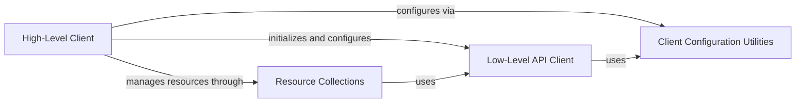

## Component Details

This graph illustrates the core components of the `docker-py` library's client subsystem. The `High-Level Client` provides an intuitive object-oriented interface, acting as the primary entry point for user interactions. It delegates complex operations to the `Low-Level API Client` for direct communication with the Docker daemon and manages various Docker entities through `Resource Collections`. Client configuration, including environment variable parsing, authentication, and proxy settings, is handled by `Client Configuration Utilities`.

### High-Level Client
Provides a user-friendly, object-oriented interface for interacting with the Docker daemon, abstracting the underlying API. It serves as the primary entry point for most user operations, delegating to the Low-Level API Client and managing resources via Resource Collections.

**Related Classes/Methods**:

- <a href="https://github.com/docker/docker-py/blob/master/docker/client.py#L16-L219" target="_blank" rel="noopener noreferrer">`docker.client.DockerClient` (16:219)</a>
- <a href="https://github.com/docker/docker-py/blob/master/docker/client.py#L44-L45" target="_blank" rel="noopener noreferrer">`docker.client.DockerClient:__init__` (44:45)</a>
- <a href="https://github.com/docker/docker-py/blob/master/docker/client.py#L48-L100" target="_blank" rel="noopener noreferrer">`docker.client.DockerClient:from_env` (48:100)</a>
- <a href="https://github.com/docker/docker-py/blob/master/docker/client.py#L104-L109" target="_blank" rel="noopener noreferrer">`docker.client.DockerClient:configs` (104:109)</a>
- <a href="https://github.com/docker/docker-py/blob/master/docker/client.py#L112-L117" target="_blank" rel="noopener noreferrer">`docker.client.DockerClient:containers` (112:117)</a>
- <a href="https://github.com/docker/docker-py/blob/master/docker/client.py#L120-L125" target="_blank" rel="noopener noreferrer">`docker.client.DockerClient:images` (120:125)</a>
- <a href="https://github.com/docker/docker-py/blob/master/docker/client.py#L128-L133" target="_blank" rel="noopener noreferrer">`docker.client.DockerClient:networks` (128:133)</a>
- <a href="https://github.com/docker/docker-py/blob/master/docker/client.py#L136-L141" target="_blank" rel="noopener noreferrer">`docker.client.DockerClient:nodes` (136:141)</a>
- <a href="https://github.com/docker/docker-py/blob/master/docker/client.py#L144-L149" target="_blank" rel="noopener noreferrer">`docker.client.DockerClient:plugins` (144:149)</a>
- <a href="https://github.com/docker/docker-py/blob/master/docker/client.py#L152-L157" target="_blank" rel="noopener noreferrer">`docker.client.DockerClient:secrets` (152:157)</a>
- <a href="https://github.com/docker/docker-py/blob/master/docker/client.py#L160-L165" target="_blank" rel="noopener noreferrer">`docker.client.DockerClient:services` (160:165)</a>
- <a href="https://github.com/docker/docker-py/blob/master/docker/client.py#L168-L173" target="_blank" rel="noopener noreferrer">`docker.client.DockerClient:swarm` (168:173)</a>
- <a href="https://github.com/docker/docker-py/blob/master/docker/client.py#L176-L181" target="_blank" rel="noopener noreferrer">`docker.client.DockerClient:volumes` (176:181)</a>
- <a href="https://github.com/docker/docker-py/blob/master/docker/client.py#L184-L185" target="_blank" rel="noopener noreferrer">`docker.client.DockerClient:events` (184:185)</a>
- <a href="https://github.com/docker/docker-py/blob/master/docker/client.py#L188-L189" target="_blank" rel="noopener noreferrer">`docker.client.DockerClient:df` (188:189)</a>
- <a href="https://github.com/docker/docker-py/blob/master/docker/client.py#L192-L193" target="_blank" rel="noopener noreferrer">`docker.client.DockerClient:info` (192:193)</a>
- <a href="https://github.com/docker/docker-py/blob/master/docker/client.py#L196-L197" target="_blank" rel="noopener noreferrer">`docker.client.DockerClient:login` (196:197)</a>
- <a href="https://github.com/docker/docker-py/blob/master/docker/client.py#L200-L201" target="_blank" rel="noopener noreferrer">`docker.client.DockerClient:ping` (200:201)</a>
- <a href="https://github.com/docker/docker-py/blob/master/docker/client.py#L204-L205" target="_blank" rel="noopener noreferrer">`docker.client.DockerClient:version` (204:205)</a>

### Low-Level API Client
The low-level API client responsible for direct communication with the Docker daemon. It handles the actual HTTP requests and responses, providing the core functionality that the High-Level Client builds upon by aggregating various API mixins.

**Related Classes/Methods**:

- <a href="https://github.com/docker/docker-py/blob/master/docker/api/client.py#L57-L532" target="_blank" rel="noopener noreferrer">`docker.api.client.APIClient` (57:532)</a>

### Resource Collections
A set of classes, each responsible for managing a specific type of Docker resource (e.g., configs, containers, images, networks, nodes, plugins, secrets, services, volumes). These classes provide methods for creating, listing, inspecting, and removing their respective resources, typically inheriting from a common Collection base class.

**Related Classes/Methods**:

- <a href="https://github.com/docker/docker-py/blob/master/docker/models/resource.py#L51-L92" target="_blank" rel="noopener noreferrer">`docker.models.resource.Collection` (51:92)</a>
- <a href="https://github.com/docker/docker-py/blob/master/docker/models/resource.py#L1-L48" target="_blank" rel="noopener noreferrer">`docker.models.resource.Model` (1:48)</a>
- <a href="https://github.com/docker/docker-py/blob/master/docker/models/configs.py#L27-L70" target="_blank" rel="noopener noreferrer">`docker.models.configs.ConfigCollection` (27:70)</a>
- <a href="https://github.com/docker/docker-py/blob/master/docker/models/containers.py#L532-L1029" target="_blank" rel="noopener noreferrer">`docker.models.containers.ContainerCollection` (532:1029)</a>
- <a href="https://github.com/docker/docker-py/blob/master/docker/models/images.py#L217-L495" target="_blank" rel="noopener noreferrer">`docker.models.images.ImageCollection` (217:495)</a>
- <a href="https://github.com/docker/docker-py/blob/master/docker/models/networks.py#L94-L218" target="_blank" rel="noopener noreferrer">`docker.models.networks.NetworkCollection` (94:218)</a>
- <a href="https://github.com/docker/docker-py/blob/master/docker/models/nodes.py#L64-L107" target="_blank" rel="noopener noreferrer">`docker.models.nodes.NodeCollection` (64:107)</a>
- <a href="https://github.com/docker/docker-py/blob/master/docker/models/plugins.py#L131-L206" target="_blank" rel="noopener noreferrer">`docker.models.plugins.PluginCollection` (131:206)</a>
- <a href="https://github.com/docker/docker-py/blob/master/docker/models/secrets.py#L27-L70" target="_blank" rel="noopener noreferrer">`docker.models.secrets.SecretCollection` (27:70)</a>
- <a href="https://github.com/docker/docker-py/blob/master/docker/models/services.py#L146-L284" target="_blank" rel="noopener noreferrer">`docker.models.services.ServiceCollection` (146:284)</a>
- <a href="https://github.com/docker/docker-py/blob/master/docker/models/swarm.py#L7-L190" target="_blank" rel="noopener noreferrer">`docker.models.swarm.Swarm` (7:190)</a>
- <a href="https://github.com/docker/docker-py/blob/master/docker/models/volumes.py#L28-L99" target="_blank" rel="noopener noreferrer">`docker.models.volumes.VolumeCollection` (28:99)</a>

### Client Configuration Utilities
Contains helper functions and utilities primarily used for configuring the Docker client, such as parsing environment variables, handling authentication, and proxy settings.

**Related Classes/Methods**:

- <a href="https://github.com/docker/docker-py/blob/master/docker/utils/utils.py#L353-L388" target="_blank" rel="noopener noreferrer">`docker.utils.utils.kwargs_from_env` (353:388)</a>
- <a href="https://github.com/docker/docker-py/blob/master/docker/auth.py#L75-L306" target="_blank" rel="noopener noreferrer">`docker.auth.AuthConfig` (75:306)</a>
- <a href="https://github.com/docker/docker-py/blob/master/docker/utils/proxy.py#L4-L77" target="_blank" rel="noopener noreferrer">`docker.utils.proxy.ProxyConfig` (4:77)</a>

### [FAQ](https://github.com/CodeBoarding/GeneratedOnBoardings/tree/main?tab=readme-ov-file#faq)