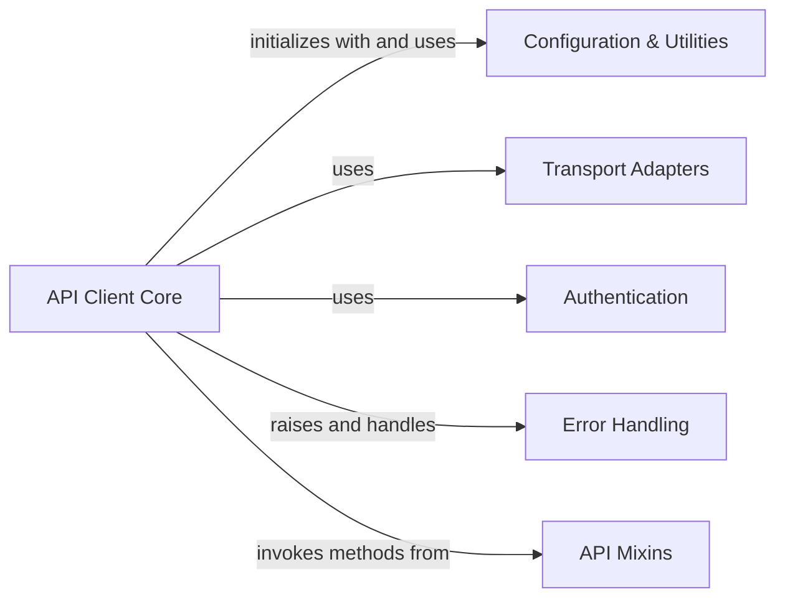

## Component Details

The Low-Level API Client subsystem in docker-py provides the core functionality for direct HTTP communication with the Docker daemon. It manages the entire lifecycle of requests, from connection establishment and dispatching (GET, POST, PUT, DELETE) to response processing and error handling. The system also integrates various API mixins to extend its capabilities for specific Docker resources like containers, images, and networks. Configuration loading, authentication, and different transport mechanisms (Unix sockets, named pipes, SSH) are also handled within this subsystem to ensure robust and flexible communication with the Docker daemon.

### API Client Core
The central component for interacting with the Docker daemon. It handles connection establishment, request dispatching (GET, POST, PUT, DELETE), response processing, and streaming. It also manages server version compatibility and configuration reloading.

**Related Classes/Methods**:

- <a href="https://github.com/docker/docker-py/blob/master/docker/api/client.py#L57-L532" target="_blank" rel="noopener noreferrer">`docker.api.client.APIClient` (57:532)</a>
- <a href="https://github.com/docker/docker-py/blob/master/docker/api/client.py#L115-L219" target="_blank" rel="noopener noreferrer">`docker.api.client.APIClient:__init__` (115:219)</a>
- <a href="https://github.com/docker/docker-py/blob/master/docker/api/client.py#L221-L232" target="_blank" rel="noopener noreferrer">`docker.api.client.APIClient:_retrieve_server_version` (221:232)</a>
- <a href="https://github.com/docker/docker-py/blob/master/docker/api/client.py#L241-L242" target="_blank" rel="noopener noreferrer">`docker.api.client.APIClient:_post` (241:242)</a>
- <a href="https://github.com/docker/docker-py/blob/master/docker/api/client.py#L245-L246" target="_blank" rel="noopener noreferrer">`docker.api.client.APIClient:_get` (245:246)</a>
- <a href="https://github.com/docker/docker-py/blob/master/docker/api/client.py#L249-L250" target="_blank" rel="noopener noreferrer">`docker.api.client.APIClient:_put` (249:250)</a>
- <a href="https://github.com/docker/docker-py/blob/master/docker/api/client.py#L253-L254" target="_blank" rel="noopener noreferrer">`docker.api.client.APIClient:_delete` (253:254)</a>
- <a href="https://github.com/docker/docker-py/blob/master/docker/api/client.py#L272-L277" target="_blank" rel="noopener noreferrer">`docker.api.client.APIClient:_raise_for_status` (272:277)</a>
- <a href="https://github.com/docker/docker-py/blob/master/docker/api/client.py#L279-L287" target="_blank" rel="noopener noreferrer">`docker.api.client.APIClient:_result` (279:287)</a>
- <a href="https://github.com/docker/docker-py/blob/master/docker/api/client.py#L289-L303" target="_blank" rel="noopener noreferrer">`docker.api.client.APIClient:_post_json` (289:303)</a>
- <a href="https://github.com/docker/docker-py/blob/master/docker/api/client.py#L313-L319" target="_blank" rel="noopener noreferrer">`docker.api.client.APIClient:_attach_websocket` (313:319)</a>
- <a href="https://github.com/docker/docker-py/blob/master/docker/api/client.py#L321-L331" target="_blank" rel="noopener noreferrer">`docker.api.client.APIClient:_create_websocket_connection` (321:331)</a>
- <a href="https://github.com/docker/docker-py/blob/master/docker/api/client.py#L333-L353" target="_blank" rel="noopener noreferrer">`docker.api.client.APIClient:_get_raw_response_socket` (333:353)</a>
- <a href="https://github.com/docker/docker-py/blob/master/docker/api/client.py#L355-L374" target="_blank" rel="noopener noreferrer">`docker.api.client.APIClient:_stream_helper` (355:374)</a>
- <a href="https://github.com/docker/docker-py/blob/master/docker/api/client.py#L376-L390" target="_blank" rel="noopener noreferrer">`docker.api.client.APIClient:_multiplexed_buffer_helper` (376:390)</a>
- <a href="https://github.com/docker/docker-py/blob/master/docker/api/client.py#L392-L411" target="_blank" rel="noopener noreferrer">`docker.api.client.APIClient:_multiplexed_response_stream_helper` (392:411)</a>
- <a href="https://github.com/docker/docker-py/blob/master/docker/api/client.py#L413-L422" target="_blank" rel="noopener noreferrer">`docker.api.client.APIClient:_stream_raw_result` (413:422)</a>
- <a href="https://github.com/docker/docker-py/blob/master/docker/api/client.py#L424-L447" target="_blank" rel="noopener noreferrer">`docker.api.client.APIClient:_read_from_socket` (424:447)</a>
- <a href="https://github.com/docker/docker-py/blob/master/docker/api/client.py#L478-L480" target="_blank" rel="noopener noreferrer">`docker.api.client.APIClient:_check_is_tty` (478:480)</a>
- <a href="https://github.com/docker/docker-py/blob/master/docker/api/client.py#L482-L483" target="_blank" rel="noopener noreferrer">`docker.api.client.APIClient:_get_result` (482:483)</a>
- <a href="https://github.com/docker/docker-py/blob/master/docker/api/client.py#L485-L499" target="_blank" rel="noopener noreferrer">`docker.api.client.APIClient:_get_result_tty` (485:499)</a>
- <a href="https://github.com/docker/docker-py/blob/master/docker/api/client.py#L518-L532" target="_blank" rel="noopener noreferrer">`docker.api.client.APIClient:reload_config` (518:532)</a>
- <a href="https://github.com/docker/docker-py/blob/master/docker/api/client.py#L234-L238" target="_blank" rel="noopener noreferrer">`docker.api.client.APIClient._set_request_timeout` (234:238)</a>
- <a href="https://github.com/docker/docker-py/blob/master/docker/api/client.py#L501-L503" target="_blank" rel="noopener noreferrer">`docker.api.client.APIClient._unmount` (501:503)</a>
- <a href="https://github.com/docker/docker-py/blob/master/docker/api/client.py#L256-L270" target="_blank" rel="noopener noreferrer">`docker.api.client.APIClient._url` (256:270)</a>
- <a href="https://github.com/docker/docker-py/blob/master/docker/api/client.py#L305-L310" target="_blank" rel="noopener noreferrer">`docker.api.client.APIClient._attach_params` (305:310)</a>

### Error Handling
This component is responsible for defining and raising specific exceptions related to Docker operations and for converting HTTP errors into more meaningful Docker exceptions.

**Related Classes/Methods**:

- <a href="https://github.com/docker/docker-py/blob/master/docker/errors.py#L120-L128" target="_blank" rel="noopener noreferrer">`docker.errors.TLSParameterError` (120:128)</a>
- <a href="https://github.com/docker/docker-py/blob/master/docker/errors.py#L13-L19" target="_blank" rel="noopener noreferrer">`docker.errors.DockerException` (13:19)</a>
- <a href="https://github.com/docker/docker-py/blob/master/docker/errors.py#L100-L101" target="_blank" rel="noopener noreferrer">`docker.errors.InvalidVersion` (100:101)</a>
- <a href="https://github.com/docker/docker-py/blob/master/docker/errors.py#L22-L39" target="_blank" rel="noopener noreferrer">`docker.errors.create_api_error_from_http_exception` (22:39)</a>

### Configuration & Utilities
Provides various utility functions for loading configurations (general, proxy, authentication), parsing host information, handling JSON streams, managing sockets, and applying decorators for resource checks.

**Related Classes/Methods**:

- <a href="https://github.com/docker/docker-py/blob/master/docker/utils/config.py#L51-L66" target="_blank" rel="noopener noreferrer">`docker.utils.config.load_general_config` (51:66)</a>
- <a href="https://github.com/docker/docker-py/blob/master/docker/utils/proxy.py#L25-L38" target="_blank" rel="noopener noreferrer">`docker.utils.proxy.ProxyConfig.from_dict` (25:38)</a>
- <a href="https://github.com/docker/docker-py/blob/master/docker/utils/utils.py#L233-L321" target="_blank" rel="noopener noreferrer">`docker.utils.utils.parse_host` (233:321)</a>
- <a href="https://github.com/docker/docker-py/blob/master/docker/utils/utils.py#L77-L78" target="_blank" rel="noopener noreferrer">`docker.utils.utils.version_lt` (77:78)</a>
- <a href="https://github.com/docker/docker-py/blob/master/docker/utils/json_stream.py#L35-L40" target="_blank" rel="noopener noreferrer">`docker.utils.json_stream.json_stream` (35:40)</a>
- <a href="https://github.com/docker/docker-py/blob/master/docker/utils/socket.py#L92-L103" target="_blank" rel="noopener noreferrer">`docker.utils.socket.frames_iter` (92:103)</a>
- <a href="https://github.com/docker/docker-py/blob/master/docker/utils/socket.py#L177-L187" target="_blank" rel="noopener noreferrer">`docker.utils.socket.demux_adaptor` (177:187)</a>
- <a href="https://github.com/docker/docker-py/blob/master/docker/utils/socket.py#L140-L174" target="_blank" rel="noopener noreferrer">`docker.utils.socket.consume_socket_output` (140:174)</a>
- <a href="https://github.com/docker/docker-py/blob/master/docker/utils/decorators.py#L7-L21" target="_blank" rel="noopener noreferrer">`docker.utils.decorators.check_resource` (7:21)</a>

### Transport Adapters
Handles the low-level communication with the Docker daemon over different transport mechanisms, such as Unix sockets, named pipes (Npipe), and SSH.

**Related Classes/Methods**:

- <a href="https://github.com/docker/docker-py/blob/master/docker/transport/unixconn.py#L45-L86" target="_blank" rel="noopener noreferrer">`docker.transport.unixconn.UnixHTTPAdapter` (45:86)</a>
- <a href="https://github.com/docker/docker-py/blob/master/docker/transport/npipeconn.py#L64-L102" target="_blank" rel="noopener noreferrer">`docker.transport.npipeconn.NpipeHTTPAdapter` (64:102)</a>
- <a href="https://github.com/docker/docker-py/blob/master/docker/transport/sshconn.py#L159-L250" target="_blank" rel="noopener noreferrer">`docker.transport.sshconn.SSHHTTPAdapter` (159:250)</a>

### Authentication
Manages the loading and handling of Docker authentication configurations.

**Related Classes/Methods**:

- <a href="https://github.com/docker/docker-py/blob/master/docker/auth.py#L348-L349" target="_blank" rel="noopener noreferrer">`docker.auth.load_config` (348:349)</a>

### API Mixins
Provides specific API functionalities related to the Docker daemon and containers, which are then integrated into the main API client.

**Related Classes/Methods**:

- <a href="https://github.com/docker/docker-py/blob/master/docker/api/daemon.py#L168-L181" target="_blank" rel="noopener noreferrer">`docker.api.daemon.DaemonApiMixin.version` (168:181)</a>
- <a href="https://github.com/docker/docker-py/blob/master/docker/api/container.py#L778-L795" target="_blank" rel="noopener noreferrer">`docker.api.container.ContainerApiMixin.inspect_container` (778:795)</a>

### [FAQ](https://github.com/CodeBoarding/GeneratedOnBoardings/tree/main?tab=readme-ov-file#faq)