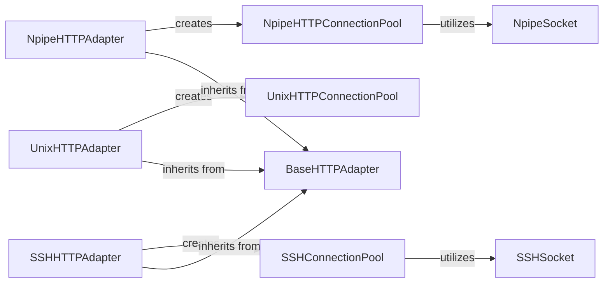

## Component Details

This overview details the Transport Layer subsystem of docker-py, which is responsible for handling low-level communication protocols to connect to the Docker daemon. It supports Npipe, Unix sockets, and SSH, managing HTTP connection pooling and socket operations across these different transport mechanisms.

### NpipeSocket
This component provides a partial implementation of the socket API over Windows named pipes. It is designed to be used as a client socket, handling connections, sending, and receiving data over named pipes. It manages the underlying Windows pipe handle and provides methods for basic socket operations like connect, send, recv, and close.

**Related Classes/Methods**:

- <a href="https://github.com/docker/docker-py/blob/master/docker/transport/npipesocket.py#L29-L203" target="_blank" rel="noopener noreferrer">`docker.transport.npipesocket.NpipeSocket` (29:203)</a>
- <a href="https://github.com/docker/docker-py/blob/master/docker/transport/npipesocket.py#L52-L81" target="_blank" rel="noopener noreferrer">`docker.transport.npipesocket.NpipeSocket:connect` (52:81)</a>
- <a href="https://github.com/docker/docker-py/blob/master/docker/transport/npipesocket.py#L84-L85" target="_blank" rel="noopener noreferrer">`docker.transport.npipesocket.NpipeSocket:connect_ex` (84:85)</a>
- <a href="https://github.com/docker/docker-py/blob/master/docker/transport/npipesocket.py#L93-L94" target="_blank" rel="noopener noreferrer">`docker.transport.npipesocket.NpipeSocket:dup` (93:94)</a>
- <a href="https://github.com/docker/docker-py/blob/master/docker/transport/npipesocket.py#L111-L117" target="_blank" rel="noopener noreferrer">`docker.transport.npipesocket.NpipeSocket:makefile` (111:117)</a>
- <a href="https://github.com/docker/docker-py/blob/master/docker/transport/npipesocket.py#L125-L127" target="_blank" rel="noopener noreferrer">`docker.transport.npipesocket.NpipeSocket:recvfrom` (125:127)</a>
- <a href="https://github.com/docker/docker-py/blob/master/docker/transport/npipesocket.py#L130-L131" target="_blank" rel="noopener noreferrer">`docker.transport.npipesocket.NpipeSocket:recvfrom_into` (130:131)</a>
- <a href="https://github.com/docker/docker-py/blob/master/docker/transport/npipesocket.py#L172-L173" target="_blank" rel="noopener noreferrer">`docker.transport.npipesocket.NpipeSocket:sendall` (172:173)</a>
- <a href="https://github.com/docker/docker-py/blob/master/docker/transport/npipesocket.py#L176-L178" target="_blank" rel="noopener noreferrer">`docker.transport.npipesocket.NpipeSocket:sendto` (176:178)</a>
- <a href="https://github.com/docker/docker-py/blob/master/docker/transport/npipesocket.py#L180-L183" target="_blank" rel="noopener noreferrer">`docker.transport.npipesocket.NpipeSocket:setblocking` (180:183)</a>
- <a href="https://github.com/docker/docker-py/blob/master/docker/transport/npipesocket.py#L202-L203" target="_blank" rel="noopener noreferrer">`docker.transport.npipesocket.NpipeSocket:shutdown` (202:203)</a>

### NpipeHTTPConnectionPool
This component manages a pool of NpipeHTTPConnection instances. It's responsible for creating new connections when needed and reusing existing ones to optimize performance and resource utilization when communicating with a named pipe endpoint. It overrides urllib3's default connection pooling behavior to specifically handle named pipe connections.

**Related Classes/Methods**:

- <a href="https://github.com/docker/docker-py/blob/master/docker/transport/npipeconn.py#L29-L61" target="_blank" rel="noopener noreferrer">`docker.transport.npipeconn.NpipeHTTPConnectionPool` (29:61)</a>
- <a href="https://github.com/docker/docker-py/blob/master/docker/transport/npipeconn.py#L37-L40" target="_blank" rel="noopener noreferrer">`docker.transport.npipeconn.NpipeHTTPConnectionPool:_new_conn` (37:40)</a>
- <a href="https://github.com/docker/docker-py/blob/master/docker/transport/npipeconn.py#L45-L61" target="_blank" rel="noopener noreferrer">`docker.transport.npipeconn.NpipeHTTPConnectionPool:_get_conn` (45:61)</a>

### NpipeHTTPAdapter
This component is a Requests adapter that integrates named pipe communication into the Requests library. It provides a mechanism to obtain connections from the NpipeHTTPConnectionPool and handles the URL scheme for named pipes (npipe://) to route requests appropriately.

**Related Classes/Methods**:

- <a href="https://github.com/docker/docker-py/blob/master/docker/transport/npipeconn.py#L64-L102" target="_blank" rel="noopener noreferrer">`docker.transport.npipeconn.NpipeHTTPAdapter` (64:102)</a>
- <a href="https://github.com/docker/docker-py/blob/master/docker/transport/npipeconn.py#L82-L94" target="_blank" rel="noopener noreferrer">`docker.transport.npipeconn.NpipeHTTPAdapter:get_connection` (82:94)</a>

### UnixHTTPConnectionPool
This component is responsible for managing a pool of HTTP connections over Unix sockets. It creates and reuses UnixHTTPConnection instances for efficient communication with services exposed via Unix domain sockets.

**Related Classes/Methods**:

- <a href="https://github.com/docker/docker-py/blob/master/docker/transport/unixconn.py#L30-L42" target="_blank" rel="noopener noreferrer">`docker.transport.unixconn.UnixHTTPConnectionPool` (30:42)</a>
- <a href="https://github.com/docker/docker-py/blob/master/docker/transport/unixconn.py#L39-L42" target="_blank" rel="noopener noreferrer">`docker.transport.unixconn.UnixHTTPConnectionPool:_new_conn` (39:42)</a>

### UnixHTTPAdapter
This component is a Requests adapter that integrates Unix socket communication into the Requests library. It obtains connections from the UnixHTTPConnectionPool and handles the URL scheme for Unix sockets.

**Related Classes/Methods**:

- <a href="https://github.com/docker/docker-py/blob/master/docker/transport/unixconn.py#L45-L86" target="_blank" rel="noopener noreferrer">`docker.transport.unixconn.UnixHTTPAdapter` (45:86)</a>
- <a href="https://github.com/docker/docker-py/blob/master/docker/transport/unixconn.py#L66-L78" target="_blank" rel="noopener noreferrer">`docker.transport.unixconn.UnixHTTPAdapter:get_connection` (66:78)</a>

### SSHSocket
This component provides a socket-like interface for SSH connections. It handles sending and receiving data over an SSH channel, abstracting the underlying SSH protocol details.

**Related Classes/Methods**:

- <a href="https://github.com/docker/docker-py/blob/master/docker/transport/sshconn.py#L20-L95" target="_blank" rel="noopener noreferrer">`docker.transport.sshconn.SSHSocket` (20:95)</a>
- <a href="https://github.com/docker/docker-py/blob/master/docker/transport/sshconn.py#L71-L72" target="_blank" rel="noopener noreferrer">`docker.transport.sshconn.SSHSocket:sendall` (71:72)</a>
- <a href="https://github.com/docker/docker-py/blob/master/docker/transport/sshconn.py#L74-L75" target="_blank" rel="noopener noreferrer">`docker.transport.sshconn.SSHSocket:send` (74:75)</a>
- <a href="https://github.com/docker/docker-py/blob/master/docker/transport/sshconn.py#L83-L88" target="_blank" rel="noopener noreferrer">`docker.transport.sshconn.SSHSocket:makefile` (83:88)</a>

### SSHConnectionPool
This component manages a pool of SSHConnection instances. It's responsible for creating new SSH connections and reusing existing ones to optimize performance when communicating over SSH.

**Related Classes/Methods**:

- <a href="https://github.com/docker/docker-py/blob/master/docker/transport/sshconn.py#L120-L156" target="_blank" rel="noopener noreferrer">`docker.transport.sshconn.SSHConnectionPool` (120:156)</a>
- <a href="https://github.com/docker/docker-py/blob/master/docker/transport/sshconn.py#L133-L134" target="_blank" rel="noopener noreferrer">`docker.transport.sshconn.SSHConnectionPool:_new_conn` (133:134)</a>
- <a href="https://github.com/docker/docker-py/blob/master/docker/transport/sshconn.py#L139-L156" target="_blank" rel="noopener noreferrer">`docker.transport.sshconn.SSHConnectionPool:_get_conn` (139:156)</a>

### SSHHTTPAdapter
This component is a Requests adapter that integrates SSH communication into the Requests library. It handles the initialization of Paramiko client, establishes SSH connections, and obtains connections from the SSHConnectionPool to route HTTP requests over SSH.

**Related Classes/Methods**:

- <a href="https://github.com/docker/docker-py/blob/master/docker/transport/sshconn.py#L159-L250" target="_blank" rel="noopener noreferrer">`docker.transport.sshconn.SSHHTTPAdapter` (159:250)</a>
- <a href="https://github.com/docker/docker-py/blob/master/docker/transport/sshconn.py#L165-L183" target="_blank" rel="noopener noreferrer">`docker.transport.sshconn.SSHHTTPAdapter:__init__` (165:183)</a>
- <a href="https://github.com/docker/docker-py/blob/master/docker/transport/sshconn.py#L220-L245" target="_blank" rel="noopener noreferrer">`docker.transport.sshconn.SSHHTTPAdapter:get_connection` (220:245)</a>
- <a href="https://github.com/docker/docker-py/blob/master/docker/transport/sshconn.py#L247-L250" target="_blank" rel="noopener noreferrer">`docker.transport.sshconn.SSHHTTPAdapter:close` (247:250)</a>

### BaseHTTPAdapter
This is a base class for HTTP adapters in the Requests library, providing common functionality for handling HTTP connections and requests. It serves as an abstraction layer for different transport mechanisms.

**Related Classes/Methods**:

- <a href="https://github.com/docker/docker-py/blob/master/docker/transport/basehttpadapter.py#L4-L13" target="_blank" rel="noopener noreferrer">`docker.transport.basehttpadapter.BaseHTTPAdapter` (4:13)</a>

### [FAQ](https://github.com/CodeBoarding/GeneratedOnBoardings/tree/main?tab=readme-ov-file#faq)