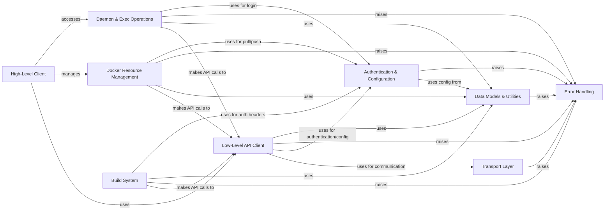

## Component Details

The `docker-py` library provides a comprehensive Python interface for interacting with the Docker daemon. It is structured into a high-level client for ease of use and a low-level API client for direct communication. The system manages various Docker resources like containers, images, networks, and volumes, and handles advanced features such as Swarm, services, plugins, secrets, and configurations. It includes robust mechanisms for authentication, credential management, Docker context handling, and image building. Underlying these functionalities are a flexible transport layer supporting different communication protocols and a dedicated error handling system, all supported by a rich set of data models and utility functions.

### High-Level Client
Provides a user-friendly, object-oriented interface for interacting with the Docker daemon, abstracting the underlying API. It serves as the primary entry point for most user operations.

**Related Classes/Methods**:

- <a href="https://github.com/docker/docker-py/blob/master/docker/client.py#L16-L219" target="_blank" rel="noopener noreferrer">`docker-py.docker.client.DockerClient` (16:219)</a>
- <a href="https://github.com/docker/docker-py/blob/master/docker/client.py#L44-L45" target="_blank" rel="noopener noreferrer">`docker-py.docker.client.DockerClient:__init__` (44:45)</a>
- <a href="https://github.com/docker/docker-py/blob/master/docker/client.py#L48-L100" target="_blank" rel="noopener noreferrer">`docker-py.docker.client.DockerClient:from_env` (48:100)</a>

### Low-Level API Client
Handles direct HTTP communication with the Docker daemon, managing requests, responses, and error handling. It serves as the core communication layer and integrates various API mixins.

**Related Classes/Methods**:

- <a href="https://github.com/docker/docker-py/blob/master/docker/api/client.py#L57-L532" target="_blank" rel="noopener noreferrer">`docker-py.docker.api.client.APIClient` (57:532)</a>
- <a href="https://github.com/docker/docker-py/blob/master/docker/api/client.py#L115-L219" target="_blank" rel="noopener noreferrer">`docker-py.docker.api.client.APIClient:__init__` (115:219)</a>
- <a href="https://github.com/docker/docker-py/blob/master/docker/api/client.py#L241-L242" target="_blank" rel="noopener noreferrer">`docker-py.docker.api.client.APIClient:_post` (241:242)</a>

### Docker Resource Management
Encompasses the API mixins and object models for managing the lifecycle and operations of various Docker resources like containers, images, networks, volumes, swarm, services, plugins, secrets, and configurations.

**Related Classes/Methods**:

- <a href="https://github.com/docker/docker-py/blob/master/docker/api/container.py#L14-L1348" target="_blank" rel="noopener noreferrer">`docker-py.docker.api.container.ContainerApiMixin` (14:1348)</a>
- <a href="https://github.com/docker/docker-py/blob/master/docker/models/containers.py#L532-L1029" target="_blank" rel="noopener noreferrer">`docker-py.docker.models.containers.ContainerCollection` (532:1029)</a>
- <a href="https://github.com/docker/docker-py/blob/master/docker/api/image.py#L10-L572" target="_blank" rel="noopener noreferrer">`docker-py.docker.api.image.ImageApiMixin` (10:572)</a>
- <a href="https://github.com/docker/docker-py/blob/master/docker/models/images.py#L217-L495" target="_blank" rel="noopener noreferrer">`docker-py.docker.models.images.ImageCollection` (217:495)</a>
- <a href="https://github.com/docker/docker-py/blob/master/docker/api/network.py#L6-L277" target="_blank" rel="noopener noreferrer">`docker-py.docker.api.network.NetworkApiMixin` (6:277)</a>
- <a href="https://github.com/docker/docker-py/blob/master/docker/models/networks.py#L94-L218" target="_blank" rel="noopener noreferrer">`docker-py.docker.models.networks.NetworkCollection` (94:218)</a>
- <a href="https://github.com/docker/docker-py/blob/master/docker/api/volume.py#L4-L163" target="_blank" rel="noopener noreferrer">`docker-py.docker.api.volume.VolumeApiMixin` (4:163)</a>
- <a href="https://github.com/docker/docker-py/blob/master/docker/models/volumes.py#L28-L99" target="_blank" rel="noopener noreferrer">`docker-py.docker.models.volumes.VolumeCollection` (28:99)</a>
- <a href="https://github.com/docker/docker-py/blob/master/docker/api/swarm.py#L10-L462" target="_blank" rel="noopener noreferrer">`docker-py.docker.api.swarm.SwarmApiMixin` (10:462)</a>
- <a href="https://github.com/docker/docker-py/blob/master/docker/models/swarm.py#L7-L190" target="_blank" rel="noopener noreferrer">`docker-py.docker.models.swarm.Swarm` (7:190)</a>
- <a href="https://github.com/docker/docker-py/blob/master/docker/api/service.py#L114-L486" target="_blank" rel="noopener noreferrer">`docker-py.docker.api.service.ServiceApiMixin` (114:486)</a>
- <a href="https://github.com/docker/docker-py/blob/master/docker/models/services.py#L146-L284" target="_blank" rel="noopener noreferrer">`docker-py.docker.models.services.ServiceCollection` (146:284)</a>
- <a href="https://github.com/docker/docker-py/blob/master/docker/api/plugin.py#L4-L261" target="_blank" rel="noopener noreferrer">`docker-py.docker.api.plugin.PluginApiMixin` (4:261)</a>
- <a href="https://github.com/docker/docker-py/blob/master/docker/models/plugins.py#L131-L206" target="_blank" rel="noopener noreferrer">`docker-py.docker.models.plugins.PluginCollection` (131:206)</a>
- <a href="https://github.com/docker/docker-py/blob/master/docker/api/secret.py#L6-L98" target="_blank" rel="noopener noreferrer">`docker-py.docker.api.secret.SecretApiMixin` (6:98)</a>
- <a href="https://github.com/docker/docker-py/blob/master/docker/models/secrets.py#L27-L70" target="_blank" rel="noopener noreferrer">`docker-py.docker.models.secrets.SecretCollection` (27:70)</a>
- <a href="https://github.com/docker/docker-py/blob/master/docker/api/config.py#L6-L92" target="_blank" rel="noopener noreferrer">`docker-py.docker.api.config.ConfigApiMixin` (6:92)</a>
- <a href="https://github.com/docker/docker-py/blob/master/docker/models/configs.py#L27-L70" target="_blank" rel="noopener noreferrer">`docker-py.docker.models.configs.ConfigCollection` (27:70)</a>

### Daemon & Exec Operations
Provides functionalities for general Docker daemon operations (e.g., info, events, login) and executing commands within running containers.

**Related Classes/Methods**:

- <a href="https://github.com/docker/docker-py/blob/master/docker/api/daemon.py#L7-L181" target="_blank" rel="noopener noreferrer">`docker-py.docker.api.daemon.DaemonApiMixin` (7:181)</a>
- <a href="https://github.com/docker/docker-py/blob/master/docker/api/daemon.py#L83-L95" target="_blank" rel="noopener noreferrer">`docker-py.docker.api.daemon.DaemonApiMixin:info` (83:95)</a>
- <a href="https://github.com/docker/docker-py/blob/master/docker/api/exec_api.py#L5-L176" target="_blank" rel="noopener noreferrer">`docker-py.docker.api.exec_api.ExecApiMixin` (5:176)</a>
- <a href="https://github.com/docker/docker-py/blob/master/docker/api/exec_api.py#L7-L78" target="_blank" rel="noopener noreferrer">`docker-py.docker.api.exec_api.ExecApiMixin:exec_create` (7:78)</a>

### Build System
Manages the process of building Docker images from Dockerfiles, including context archiving, file exclusion, and authentication for base image pulls.

**Related Classes/Methods**:

- <a href="https://github.com/docker/docker-py/blob/master/docker/api/build.py#L11-L352" target="_blank" rel="noopener noreferrer">`docker-py.docker.api.build.BuildApiMixin` (11:352)</a>
- <a href="https://github.com/docker/docker-py/blob/master/docker/api/build.py#L12-L275" target="_blank" rel="noopener noreferrer">`docker-py.docker.api.build.BuildApiMixin:build` (12:275)</a>
- <a href="https://github.com/docker/docker-py/blob/master/docker/utils/build.py#L70-L120" target="_blank" rel="noopener noreferrer">`docker-py.docker.utils.build.create_archive` (70:120)</a>

### Authentication & Configuration
Manages Docker registry authentication, credential storage, Docker context profiles (connection settings), and general configuration file loading and parsing.

**Related Classes/Methods**:

- <a href="https://github.com/docker/docker-py/blob/master/docker/auth.py#L75-L306" target="_blank" rel="noopener noreferrer">`docker-py.docker.auth.AuthConfig` (75:306)</a>
- <a href="https://github.com/docker/docker-py/blob/master/docker/auth.py#L144-L189" target="_blank" rel="noopener noreferrer">`docker-py.docker.auth.AuthConfig:load_config` (144:189)</a>
- <a href="https://github.com/docker/docker-py/blob/master/docker/credentials/store.py#L11-L93" target="_blank" rel="noopener noreferrer">`docker-py.docker.credentials.store.Store` (11:93)</a>
- <a href="https://github.com/docker/docker-py/blob/master/docker/context/context.py#L16-L249" target="_blank" rel="noopener noreferrer">`docker-py.docker.context.context.Context` (16:249)</a>
- <a href="https://github.com/docker/docker-py/blob/master/docker/context/api.py#L15-L206" target="_blank" rel="noopener noreferrer">`docker-py.docker.context.api.ContextAPI` (15:206)</a>
- <a href="https://github.com/docker/docker-py/blob/master/docker/utils/config.py#L51-L66" target="_blank" rel="noopener noreferrer">`docker-py.docker.utils.config:load_general_config` (51:66)</a>

### Transport Layer
Handles low-level communication protocols for connecting to the Docker daemon, supporting Npipe, Unix sockets, and SSH. It manages HTTP connection pooling and socket operations.

**Related Classes/Methods**:

- <a href="https://github.com/docker/docker-py/blob/master/docker/transport/npipesocket.py#L29-L203" target="_blank" rel="noopener noreferrer">`docker-py.docker.transport.npipesocket.NpipeSocket` (29:203)</a>
- <a href="https://github.com/docker/docker-py/blob/master/docker/transport/unixconn.py#L45-L86" target="_blank" rel="noopener noreferrer">`docker-py.docker.transport.unixconn.UnixHTTPAdapter` (45:86)</a>
- <a href="https://github.com/docker/docker-py/blob/master/docker/transport/sshconn.py#L159-L250" target="_blank" rel="noopener noreferrer">`docker-py.docker.transport.sshconn.SSHHTTPAdapter` (159:250)</a>

### Error Handling
Defines and manages custom exceptions specific to Docker operations, providing a structured way to report and handle various error conditions encountered during API interactions or client-side processing.

**Related Classes/Methods**:

- <a href="https://github.com/docker/docker-py/blob/master/docker/errors.py#L42-L89" target="_blank" rel="noopener noreferrer">`docker-py.docker.errors.APIError` (42:89)</a>
- <a href="https://github.com/docker/docker-py/blob/master/docker/errors.py#L13-L19" target="_blank" rel="noopener noreferrer">`docker-py.docker.errors.DockerException` (13:19)</a>

### Data Models & Utilities
Provides structured data models for various Docker API objects and configurations, along with a collection of general-purpose helper functions for data parsing, environment variable handling, version comparisons, and stream processing.

**Related Classes/Methods**:

- <a href="https://github.com/docker/docker-py/blob/master/docker/tls.py#L6-L67" target="_blank" rel="noopener noreferrer">`docker-py.docker.tls.TLSConfig` (6:67)</a>
- <a href="https://github.com/docker/docker-py/blob/master/docker/types/containers.py#L264-L662" target="_blank" rel="noopener noreferrer">`docker-py.docker.types.containers.HostConfig` (264:662)</a>
- <a href="https://github.com/docker/docker-py/blob/master/docker/utils/utils.py#L10-L500" target="_blank" rel="noopener noreferrer">`docker-py.docker.utils.utils` (10:500)</a>
- <a href="https://github.com/docker/docker-py/blob/master/docker/utils/json_stream.py#L35-L40" target="_blank" rel="noopener noreferrer">`docker-py.docker.utils.json_stream:json_stream` (35:40)</a>

### [FAQ](https://github.com/CodeBoarding/GeneratedOnBoardings/tree/main?tab=readme-ov-file#faq)